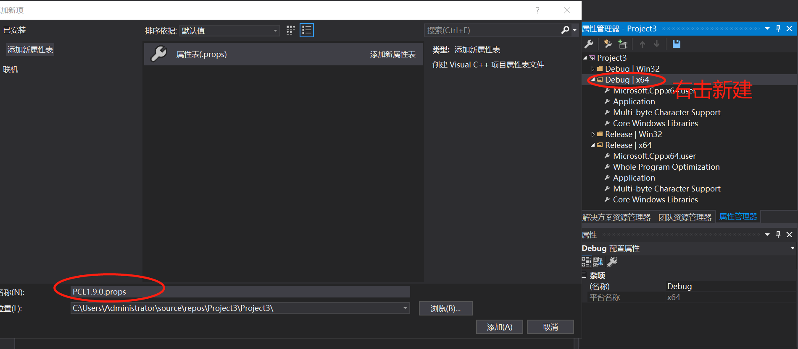

# C++SDK文档


# 版本更新记录
上线日期 | 版本号 | 更新内容
:-: | :-: | :-: 
2022.02.15 | v0.4.0 | 初版，sdk开源 
2022.04.28 | v0.5.1 | 增加UDP通讯库，GetPerceptionDemo，ImageStorageDemo，合并Ros wrapper，新增framerateset service，适配ubuntu20.04，更新sdk文档 
2022.05.27 | v0.5.2 | 兼容S3设备，修复视差转3D数据异常问题 
2022.06.14 | v0.5.3 | 增加GetObstacleDemo 


# 简介

本文档主要针对使用中科慧眼猎户座系列产品进行二次开发者，描述中科慧眼图像处理接口服务的相关技术内容。如果您对文档内容有任何疑问，可以联系我司技术支持与技术管理人员，联系方式：

## 接口能力
提供图像数据、算法数据、相机标定数据等。  
图像数据及算法数据通用结构体 `RawImageFrame`。

```C++
struct RawImageFrame
{
    uint16_t frameId;          //数据类型ID
    int64_t  time;			   //时间戳
    uint16_t index;			   //索引（保留字段，默认为0）
    uint16_t format;		   //帧格式
    uint16_t width;			   //图像宽度
    uint16_t height;		   //图像高度
    uint32_t speed;			   //行驶速度
    uint32_t dataSize;		   //图像数据大小
    uint8_t  image[0];		   //图像数据首地址
};
```
其中 `frameId` 为区别不同图像数据身份的唯一标识，它的定义如下。
```C++
struct FrameId
{
    enum Enumeration {
        NotUsed              = 0,
        LeftCamera           = 1 << 0,		//左相机原图
        RightCamera          = 1 << 1,		//右相机原图
        CalibLeftCamera      = 1 << 2,		//左相机校准图
        CalibRightCamera     = 1 << 3,		//右相机校准图
        DisparityDSBak       = 1 << 4,
        DisparityUV          = 1 << 5,
        Disparity            = 1 << 6,		//视差数据
        DisparityPlus        = 1 << 7,
        DisparityDS          = 1 << 8,		//降采样视差数据
        Lane                 = 1 << 9,		//车道线数据
        Obstacle             = 1 << 10,		//障碍物数据
        Compound             = 1 << 11,		//左校准图与障碍物数据的复合数据
        LDownSample          = 1 << 12,		//降采样左校准图
        RDownSample          = 1 << 13,		//降采样右校准图
        LaneExt              = 1 << 14,		//左校准图与车道线数据的复合数据
    };
};
```
 `相机原图` 与 `相机校准图`的关系为：校准图是将标定数据作用于原图而得到的。  
 目前出货设备均已完成标定流程，处于 `正常模式` ，在该模式下，提供的是 `左右相机校准图` ，而不是 `左右相机原图`。

### 值得注意的是：
1. FrameId::LeftCamera 不可和 FrameId::CalibLeftCamera同时获取。
2. FrameId::RightCamera 不可和 FrameId::CalibRightCamera同时获取。
3. FrameId::Lane不可和 FrameId::LaneExt同时获取。
4. FrameId::Obstacle不可和 FrameId::Compound同时获取。
5. FrameId::Disparity即视差数据左边有104pixel宽度的空白，为匹配后所填充。

# 快速入门

## 安装SmartEye SDK

1. 在官方网站下载、或由FAE提供指定C++ SDK压缩包。
2. 将下载的压缩包解压，其中文件包含SDK的实现代码以及相关Demo
3. SmartEye SDK目录结构

```bash
Sdk-Release_linux-g++_v0.2.33
├── Runtime
│   └── Bin
└── Src
    └── SDK
        ├── comm.pri
        ├── Examples
        │   ├── Disparity2Real3dDemo
        │   ├── Disparity2RGBDemo
        │   ├── DisplayFramesDemo
        │   ├── GetCameraParamDemo
        │   ├── GetCompoundDemo
        │   ├── GetLaneExtDemo
        │   ├── GetMotionDataDemo
        │   ├── PointCloudDemo
        │   │── StereoCameraDemo
		│   └── GetDeviceInfoDemo
        ├── inc
        └── SatpExt 
```

## 编译和运行环境要求

#### 最低支持C++11

#### 最低支持CMake 3.0

#### Qt：Linux——5.12；Windows——5.12

#### OpenCV：3.4.1，4.5.1

#### PCL:1.9.0，1.12.0


## 配置编译和运行环境

 

###  Windows 10（64位）

 

#### 安装VS2017

#### 安装Qt5.12 

#### 配置OpenCV 

1. 下载并安装cmake3.20

2. 下载并安装opencv-3.4.1-vc14_vc15.exe

  **注：尽管 Windows 环境拥有预编译的 release 版本的库，但是它并不包含 debug 版本的库。所   以，在开发 OpenCV 之前，需要打开解决方案并且自行编译这些库。**

3. 编译，如下图所示

<div align = 'center'>


</div>

<div align = 'center'>
    Fig1
</div>
然后用VS2017打开工程，并编译。

4. 设置环境变量，点击进入“此电脑”->“属性”->“高级设置”，如图所示

   <div align = 'center'>

 

</div>

<div align = 'center'>
    Fig2
</div>  

​              


点击环境变量，进入路径，如图所示

 <div align = 'center'>


</div>

<div align = 'center'>
    Fig3
</div>

​                                                                         

5. 在VS2017中配置Opencv

​      新建空项目，点击项目进入属性管理器，以Debug|x64为例，如图所示

<div align = 'center'>


</div>

<div align = 'center'>
    Fig4
</div>


双击Microsoft.Cpp.x64.user,进入属性页

<div align = 'center'>


 

</div>

<div align = 'center'>
    Fig5
</div>                                                                 

修改包含目录，如图所示

<div align = 'center'> 


</div>

<div align = 'center'>
    Fig6
</div>


修改库目录，如图所示

<div align = 'center'> 


</div>

<div align = 'center'>
    Fig7
</div>


​                                    

 添加依赖项，如图所示

<div align = 'center'>


 

</div>

<div align = 'center'>
    Fig8
</div>

​                                                                         

如果配置为Release，就选择opencv_world341.lib

至此，配置完成。

 

#### 配置 PCL（Point Cloud Library）

1. 下载和安装PCL-1.9.0-AllInOne-msvc2017-win64.exe，下载和解压pcl-1.9.0-pdb-msvc2017-win64.zip，将解压得到的文件夹中的内容添加到你的PCL安装目录D:\PCL 1.9.0\bin

2. VS2017配置PCL1.9.0 

​       设置系统环境变量，如图所示

<div align = 'center'>


 

</div>

<div align = 'center'>
    Fig9
</div>


打开VS2017新建空项目，在属性管理器右键点击新建属性表，以Debug|x64为例，如图所示

<div align = 'center'>


 

</div>


<div align = 'center'>
    Fig10
</div>                                                               
即可在对应的属性管理器增加新的属性表，如图所示

<div align = 'center'>


</div>

<div align = 'center'>
    Fig11
</div>


双击打开属性页，添加包含目录 

<div align = 'center'> 


</div>

<div align = 'center'>
    Fig12
</div>
添加库目录，如图所示

<div align = 'center'>


</div>


<div align = 'center'>
    Fig13
</div>


添加依赖项，如图所示

<div align = 'center'>


</div>


<div align = 'center'>
    Fig14
</div>


**依赖项列表：**

PCL:

pcl_common_debug.lib

pcl_common_release.lib

pcl_features_debug.lib

pcl_features_release.lib

pcl_filters_debug.lib

pcl_filters_release.lib

pcl_io_debug.lib

pcl_io_ply_debug.lib

pcl_io_ply_release.lib

pcl_io_release.lib

pcl_kdtree_debug.lib

pcl_kdtree_release.lib

pcl_keypoints_debug.lib

pcl_keypoints_release.lib

pcl_ml_debug.lib

pcl_ml_release.lib

pcl_octree_debug.lib

pcl_octree_release.lib

pcl_outofcore_debug.lib

pcl_outofcore_release.lib

pcl_people_debug.lib

pcl_people_release.lib

pcl_recognition_debug.lib

pcl_recognition_release.lib

pcl_registration_debug.lib

pcl_registration_release.lib

pcl_sample_consensus_debug.lib

pcl_sample_consensus_release.lib

pcl_search_debug.lib

pcl_search_release.lib

pcl_segmentation_debug.lib

pcl_segmentation_release.lib

pcl_stereo_debug.lib

pcl_stereo_release.lib

pcl_surface_debug.lib

pcl_surface_release.lib

pcl_tracking_debug.lib

pcl_tracking_release.lib

pcl_visualization_debug.lib

pcl_visualization_release.lib

pcl_common_debug.lib

pcl_common_release.lib

pcl_features_debug.lib

pcl_features_release.lib

pcl_filters_debug.lib

pcl_filters_release.lib

pcl_io_debug.lib

pcl_io_ply_debug.lib

pcl_io_ply_release.lib

pcl_io_release.lib

pcl_kdtree_debug.lib

pcl_kdtree_release.lib

pcl_keypoints_debug.lib

pcl_keypoints_release.lib

pcl_ml_debug.lib

pcl_ml_release.lib

pcl_octree_debug.lib

pcl_octree_release.lib

pcl_outofcore_debug.lib

pcl_outofcore_release.lib

pcl_people_debug.lib

pcl_people_release.lib

pcl_recognition_debug.lib

pcl_recognition_release.lib

pcl_registration_debug.lib

pcl_registration_release.lib

pcl_sample_consensus_debug.lib

pcl_sample_consensus_release.lib

pcl_search_debug.lib

pcl_search_release.lib

pcl_segmentation_debug.lib

pcl_segmentation_release.lib

pcl_stereo_debug.lib

pcl_stereo_release.lib

pcl_surface_debug.lib

pcl_surface_release.lib

pcl_tracking_debug.lib

pcl_tracking_release.lib

pcl_visualization_debug.lib

pcl_visualization_release.lib

 

VTK:

vtkalglib-8.1-gd.lib

vtkalglib-8.1.lib

vtkChartsCore-8.1-gd.lib

vtkChartsCore-8.1.lib

vtkCommonColor-8.1-gd.lib

vtkCommonColor-8.1.lib

vtkCommonComputationalGeometry-8.1-gd.lib

vtkCommonComputationalGeometry-8.1.lib

vtkCommonCore-8.1-gd.lib

vtkCommonCore-8.1.lib

vtkCommonDataModel-8.1-gd.lib

vtkCommonDataModel-8.1.lib

vtkCommonExecutionModel-8.1-gd.lib

vtkCommonExecutionModel-8.1.lib

vtkCommonMath-8.1-gd.lib

vtkCommonMath-8.1.lib

vtkCommonMisc-8.1-gd.lib

vtkCommonMisc-8.1.lib

vtkCommonSystem-8.1-gd.lib

vtkCommonSystem-8.1.lib

vtkCommonTransforms-8.1-gd.lib

vtkCommonTransforms-8.1.lib

vtkDICOMParser-8.1-gd.lib

vtkDICOMParser-8.1.lib

vtkDomainsChemistry-8.1-gd.lib

vtkDomainsChemistry-8.1.lib

vtkexoIIc-8.1-gd.lib

vtkexoIIc-8.1.lib

vtkexpat-8.1-gd.lib

vtkexpat-8.1.lib

vtkFiltersAMR-8.1-gd.lib

vtkFiltersAMR-8.1.lib

vtkFiltersCore-8.1-gd.lib

vtkFiltersCore-8.1.lib

vtkFiltersExtraction-8.1-gd.lib

vtkFiltersExtraction-8.1.lib

vtkFiltersFlowPaths-8.1-gd.lib

vtkFiltersFlowPaths-8.1.lib

vtkFiltersGeneral-8.1-gd.lib

vtkFiltersGeneral-8.1.lib

vtkFiltersGeneric-8.1-gd.lib

vtkFiltersGeneric-8.1.lib

vtkFiltersGeometry-8.1-gd.lib

vtkFiltersGeometry-8.1.lib

vtkFiltersHybrid-8.1-gd.lib

vtkFiltersHybrid-8.1.lib

vtkFiltersHyperTree-8.1-gd.lib

vtkFiltersHyperTree-8.1.lib

vtkFiltersImaging-8.1-gd.lib

vtkFiltersImaging-8.1.lib

vtkFiltersModeling-8.1-gd.lib

vtkFiltersModeling-8.1.lib

vtkFiltersParallel-8.1-gd.lib

vtkFiltersParallel-8.1.lib

vtkFiltersParallelImaging-8.1-gd.lib

vtkFiltersParallelImaging-8.1.lib

vtkFiltersPoints-8.1-gd.lib

vtkFiltersPoints-8.1.lib

vtkFiltersProgrammable-8.1-gd.lib

vtkFiltersProgrammable-8.1.lib

vtkFiltersSelection-8.1-gd.lib

vtkFiltersSelection-8.1.lib

vtkFiltersSMP-8.1-gd.lib

vtkFiltersSMP-8.1.lib

vtkFiltersSources-8.1-gd.lib

vtkFiltersSources-8.1.lib

vtkFiltersStatistics-8.1-gd.lib

vtkFiltersStatistics-8.1.lib

vtkFiltersTexture-8.1-gd.lib

vtkFiltersTexture-8.1.lib

vtkFiltersTopology-8.1-gd.lib

vtkFiltersTopology-8.1.lib

vtkFiltersVerdict-8.1-gd.lib

vtkFiltersVerdict-8.1.lib

vtkfreetype-8.1-gd.lib

vtkfreetype-8.1.lib

vtkGeovisCore-8.1-gd.lib

vtkGeovisCore-8.1.lib

vtkgl2ps-8.1-gd.lib

vtkgl2ps-8.1.lib

vtkhdf5-8.1-gd.lib

vtkhdf5-8.1.lib

vtkhdf5_hl-8.1-gd.lib

vtkhdf5_hl-8.1.lib

vtkImagingColor-8.1-gd.lib

vtkImagingColor-8.1.lib

vtkImagingCore-8.1-gd.lib

vtkImagingCore-8.1.lib

vtkImagingFourier-8.1-gd.lib

vtkImagingFourier-8.1.lib

vtkImagingGeneral-8.1-gd.lib

vtkImagingGeneral-8.1.lib

vtkImagingHybrid-8.1-gd.lib

vtkImagingHybrid-8.1.lib

vtkImagingMath-8.1-gd.lib

vtkImagingMath-8.1.lib

vtkImagingMorphological-8.1-gd.lib

vtkImagingMorphological-8.1.lib

vtkImagingSources-8.1-gd.lib

vtkImagingSources-8.1.lib

vtkImagingStatistics-8.1-gd.lib

vtkImagingStatistics-8.1.lib

vtkImagingStencil-8.1-gd.lib

vtkImagingStencil-8.1.lib

vtkInfovisCore-8.1-gd.lib

vtkInfovisCore-8.1.lib

vtkInfovisLayout-8.1-gd.lib

vtkInfovisLayout-8.1.lib

vtkInteractionImage-8.1-gd.lib

vtkInteractionImage-8.1.lib

vtkInteractionStyle-8.1-gd.lib

vtkInteractionStyle-8.1.lib

vtkInteractionWidgets-8.1-gd.lib

vtkInteractionWidgets-8.1.lib

vtkIOAMR-8.1-gd.lib

vtkIOAMR-8.1.lib

vtkIOCore-8.1-gd.lib

vtkIOCore-8.1.lib

vtkIOEnSight-8.1-gd.lib

vtkIOEnSight-8.1.lib

vtkIOExodus-8.1-gd.lib

vtkIOExodus-8.1.lib

vtkIOExport-8.1-gd.lib

vtkIOExport-8.1.lib

vtkIOExportOpenGL-8.1-gd.lib

vtkIOExportOpenGL-8.1.lib

vtkIOGeometry-8.1-gd.lib

vtkIOGeometry-8.1.lib

vtkIOImage-8.1-gd.lib

vtkIOImage-8.1.lib

vtkIOImport-8.1-gd.lib

vtkIOImport-8.1.lib

vtkIOInfovis-8.1-gd.lib

vtkIOInfovis-8.1.lib

vtkIOLegacy-8.1-gd.lib

vtkIOLegacy-8.1.lib

vtkIOLSDyna-8.1-gd.lib

vtkIOLSDyna-8.1.lib

vtkIOMINC-8.1-gd.lib

vtkIOMINC-8.1.lib

vtkIOMovie-8.1-gd.lib

vtkIOMovie-8.1.lib

vtkIONetCDF-8.1-gd.lib

vtkIONetCDF-8.1.lib

vtkIOParallel-8.1-gd.lib

vtkIOParallel-8.1.lib

vtkIOParallelXML-8.1-gd.lib

vtkIOParallelXML-8.1.lib

vtkIOPLY-8.1-gd.lib

vtkIOPLY-8.1.lib

vtkIOSQL-8.1-gd.lib

vtkIOSQL-8.1.lib

vtkIOTecplotTable-8.1-gd.lib

vtkIOTecplotTable-8.1.lib

vtkIOVideo-8.1-gd.lib

vtkIOVideo-8.1.lib

vtkIOXML-8.1-gd.lib

vtkIOXML-8.1.lib

vtkIOXMLParser-8.1-gd.lib

vtkIOXMLParser-8.1.lib

vtkjpeg-8.1-gd.lib

vtkjpeg-8.1.lib

vtkjsoncpp-8.1-gd.lib

vtkjsoncpp-8.1.lib

vtklibharu-8.1-gd.lib

vtklibharu-8.1.lib

vtklibxml2-8.1-gd.lib

vtklibxml2-8.1.lib

vtklz4-8.1-gd.lib

vtklz4-8.1.lib

vtkmetaio-8.1-gd.lib

vtkmetaio-8.1.lib

vtkNetCDF-8.1-gd.lib

vtkNetCDF-8.1.lib

vtknetcdfcpp-8.1-gd.lib

vtknetcdfcpp-8.1.lib

vtkoggtheora-8.1-gd.lib

vtkoggtheora-8.1.lib

vtkParallelCore-8.1-gd.lib

vtkParallelCore-8.1.lib

vtkpng-8.1-gd.lib

vtkpng-8.1.lib

vtkproj4-8.1-gd.lib

vtkproj4-8.1.lib

vtkRenderingAnnotation-8.1-gd.lib

vtkRenderingAnnotation-8.1.lib

vtkRenderingContext2D-8.1-gd.lib

vtkRenderingContext2D-8.1.lib

vtkRenderingContextOpenGL-8.1-gd.lib

vtkRenderingContextOpenGL-8.1.lib

vtkRenderingCore-8.1-gd.lib

vtkRenderingCore-8.1.lib

vtkRenderingFreeType-8.1-gd.lib

vtkRenderingFreeType-8.1.lib

vtkRenderingGL2PS-8.1-gd.lib

vtkRenderingGL2PS-8.1.lib

vtkRenderingImage-8.1-gd.lib

vtkRenderingImage-8.1.lib

vtkRenderingLabel-8.1-gd.lib

vtkRenderingLabel-8.1.lib

vtkRenderingLIC-8.1-gd.lib

vtkRenderingLIC-8.1.lib

vtkRenderingLOD-8.1-gd.lib

vtkRenderingLOD-8.1.lib

vtkRenderingOpenGL-8.1-gd.lib

vtkRenderingOpenGL-8.1.lib

vtkRenderingVolume-8.1-gd.lib

vtkRenderingVolume-8.1.lib

vtkRenderingVolumeOpenGL-8.1-gd.lib

vtkRenderingVolumeOpenGL-8.1.lib

vtksqlite-8.1-gd.lib

vtksqlite-8.1.lib

vtksys-8.1-gd.lib

vtksys-8.1.lib

vtktiff-8.1-gd.lib

vtktiff-8.1.lib

vtkverdict-8.1-gd.lib

vtkverdict-8.1.lib

vtkViewsContext2D-8.1-gd.lib

vtkViewsContext2D-8.1.lib

vtkViewsCore-8.1-gd.lib

vtkViewsCore-8.1.lib

vtkViewsInfovis-8.1-gd.lib

vtkViewsInfovis-8.1.lib

vtkzlib-8.1-gd.lib

vtkzlib-8.1.lib


在C/C++—>预处理器—>预处理器定义中添加，如图所示

​      _CRT_SECURE_NO_WARNINGS

​      _SCL_SECURE_NO_WARNINGS

​      _SILENCE_FPOS_SEEKPOS_DEPRECATION_WARNING

<div align = 'center'>

 

</div>

<div align = 'center'>
    Fig15
</div>


将C/C++—>所有选项—>SDL检查改为否，如图所示

<div align = 'center'>

 

</div>

<div align = 'center'>
    Fig16
</div>


至此，PCL库配置完成。

 

####  运行demo程序(Examples文件夹下)

 

1. 编译SDK库

​       使用Qt打开SDK工程，点击开始编译，生成库文件，如图所示 

<div align = 'center'>


</div>

<div align = 'center'>Fig17</div>


2. demo程序构建工程

  Demo程序位于Examples文件夹下，打开demo程序，比如“Disparity2DepthDemo”，根据OpenCV的实际安装路径，修改CMakeLists，否则构建工程过程中会报错，如图所示

<div align = 'center'>

 

</div>

<div align = 'center'>
    Fig18
</div>


打开Cmake-gui，添加路径，如图所示

<div align = 'center'>


</div>


<div align = 'center'>
    Fig19
</div>
点击Configure，设置配置参数，如图所示 

<div align = 'center'>

 

</div>

<div align = 'center'>
    Fig20
</div>


点击Finish开始构建，显示“Configuring done”表示配置成功，点击“Generate”生成vs2017工程文件。

3. 编译和运行

​       使用VS2017打开工程，点击开始编译，同时将SmarterEye-SDK-master\Runtime\Bin路径下的dll文件拷贝至debug或Release文件夹下，则可以运行demo程序 。

 

### Ubuntu 18.04 LTS （64位）

 

打开虚拟机，进入Ubuntu系统

安装g++，make等应用 ，执行sudo apt-get install g++, sudo apt-get install make

#### 安装Qt5.12

1. 下载qt-opensource-linux-x64-5.12.2.run

2. 打开终端执行 ./qt-opensource-linux-x64-5.12.2.run,点击安装

#### 安装cmake3.20

1. 下载cmake-3.20.2.tar.gz，输入指令 tar -zxvf cmake-3.20.2.tar.gz解压文件

2. 进入文件夹，打开终端，执行./bootstrap。

   **注：如果出现错误：Could Not found OpenSSL, 执行指令 sudo apt-get install libssl-dev解决缺库的问题**

3. 执行make -j

4. sudo make install

5. 验证安装版本是否成功，执行cmake --version，如图所示

   <div align = 'center'>
   
   
   
   </div>
   
   <div align = 'center'>
       Fig21
   </div>

表示安装成功。 

#### 安装OpenCV 

1. 下载并解压opencv-3.4.1.tar.gz

2. 进入解压文件，打开终端，安装依赖包 sudo apt-get install build-essential pkg-config libgtk2.0-dev libavcodec-dev libavformat-dev libjpeg-dev libswscale-dev libtiff5-dev

3. 执行 cd build/,执行cmake ..,如图所示，则表示构建成功

   <div align = 'center'>


</div>

<div align = 'center'>
    Fig22
</div>


4. make，编译时间较长

5. 安装，执行sudo make install

 

#### 安装PCL（Point Cloud Library）

1. 下载并解压pcl-pcl-1.9.0.tar.gz

2. 进入解压文件，执行mkdir build，执行cd build进入build文件夹，打开终端

3. 安装依赖库  

   sudo apt-get update

   sudo apt-get install build-essential linux-libc-dev

   sudo apt-get install libusb-1.0-0-dev libusb-dev libudev-dev

   sudo apt-get install mpi-default-dev openmpi-bin openmpi-common

   sudo apt-get install libflann1.8 libflann-dev

   sudo apt-get install libeigen3-dev

   sudo apt-get install libboost-all-dev

   **注：如果需要PCLVisualizer，安装OpenNI、OpenNI2**

4. 执行cmake ..

5. make -j

6. sudo make install

#### 安装 ROS Melodic

1. 设置软件源

   sudo sh -c 'echo "deb http://packages.ros.org/ros/ubuntu $(lsb_release -sc) main" > /etc/apt/sources.list.d/ros-latest.list'

2. 设置密钥

   sudo apt-key adv --keyserver 'hkp://keyserver.ubuntu.com:80' --recv-key C1CF6E31E6BADE8868B172B4F42ED6FBAB17C654

3. 安装

   sudo apt update
   sudo apt install ros-melodic-desktop-full

4. 安装依赖包

   ```
   sudo apt install python-rosdep python-rosinstall python-rosinstall-generator python-wstool build-essential
   ```

5. rosdep初始化

   sudo rosdep init
   rosdep update

   **注：由于网络环境或者境外服务器被拦截等诸多因素，在初始化的过程中，可能会出现以下问题**，

   ​      **（1）执行 “sudo rosdep init” 显示 rosdep找不到命令， 首先建议更换网络，如果还是解决不了，则 执行 “ sudo gedit** **/etc/hosts”，打开文档，增加Github对应的主机地址，在最后一行添加：151.101.84.133 raw.githubusercontent.com，保存然后关闭，重新执行命令。**

   ​       **（2）执行“rosdep update”过程中，显示timeout，更改 /usr/lib/python2.7/dist-packages/rosdep2/下的三个文件*****sources_list.py、gbpdistro_support.py、rep3.py 中的DOWNLOAD_TIMEOUT = 15.0值，改成500或者更大值, 操作如下：***

   ​         **sudo vim /usr/lib/python2.7/dist-packages/rosdep2/gbpdistro_support.py**

   ​         **sudo vim /usr/lib/python2.7/dist-packages/rosdep2/sources_list.py**

   ​         **sudo vim /usr/lib/python2.7/dist-packages/rosdep2/rep3.py**

   **在实际安装过程中，还是可能会出现其他问题，请具体对待**。

   

   完成则如图所示

   <div align = "center">

   

   </div>

   <div align = "center">
    Fig23
   </div>
   
6. 若Ros 安装成功， 执行 “roscore”，则如图所示

   <div align = "center">

      

   </div>

   <div align = "center">
    Fig24
   </div>
   
7. 设置环境变量

   ```
   echo "source /opt/ros/melodic/setup.bash" >> ~/.bashrc
   source ~/.bashrc
   ```


#### 运行demo程序 

1. 直接编译

   在Ubuntu下，执行scripts路径下的build.sh脚本进行编译，<sdk>下生成SdkRelease_v0.x.x 及其压缩文件SdkRelease_v0.x.x.tar.gz, SdkRelease_v0.x.x/Runtime/Bin文件夹包含生成的sdk库和demo可执行程序; 将库文件的路径添加到环境变量中，如：`export LD_LIBRARY_PATH=/root/adas/SdkRelease_vX.X.X/Runtime/Bin`

2. 间接编译

   打开sdk库文件夹，使用Qt Creator编译sdk库，生成库文件，位于Runtime/bin下

   **注：如果Qt编译出现“cannot find -lGL“，则执行ln -s /usr/lib/x86_64-linux-gnu/libGL.so.1 /usr/lib/libGL.so命令给已存在的库文件创建一个链接到/usr/lib目录，重启Qt**

   打开Examples，进入demo程序,如：Disparity2DepthDemo

   打开终端，执行mkdir build，建立build文件夹

   执行cd build,进入build文件夹，执行cmake ..

   执行make，自动编译

   编译结束，生成的可执行程序位于Runtime/bin,如图所示

   <div align = 'center'>


</div>

<div align = 'center'>
    Fig25
</div>


3.  在当前文件夹下，打开终端执行即可运行程序，如./Disparity2DepthDemo。


#### 使用ROS Wrapper

1. 目录结构如下

```
       <sdk>/wrapper
       └── ros
           └── src
               └── zkhy_stereo_d
                   ├── CMakeLists.txt
                   ├── launch
                   │   ├── display.launch
                   │   └── zkhy_stereo.launch
                   ├── package.xml
                   ├── rviz
                   │   └── zkhy_stereo.rviz
                   ├── src
                   │   ├── framemonitor.cpp
                   │   ├── framemonitor.h
                   │   ├── stereo_listener.cpp
                   │   ├── stereo_publisher.cpp
                   │   └── stereo_publisher.h
                   └── srv
                       ├── CameraParams.srv
                       └── RotationMatrix.srv
```

2. 进入sdk文件夹下，新建build文件夹，执行"cmake .."，"make"生成sdk模块，位于新生成的_output文件夹下

3. 编译命令如下


       cd <sdk>/wrapper/ros/
       catkin_make
       source devel/setup.bash

4. 编译成功后，可执行 `roslaunch zkhy_stereo_d zkhy_stereo.launch` 来使用wrapper程序。

5. 执行完上一步的wrapper launch程序后，有下面这些 `topic` 以及 `service` 产生


     rostopic list
       
       /zkhy_stereo/disparity      # 深度图数据
           
       /zkhy_stereo/left/color     # 左相机彩色图
       /zkhy_stereo/left/gray      # 左相机灰度图
       
       /zkhy_stereo/right/color    # 右相机彩色图
       /zkhy_stereo/right/gray     # 右相机灰度图
       
       /zkhy_stereo/imu            # IMU数据
       /zkhy_stereo/points			# PointCloud2点云数据
       
     rosservice list
       
       /zkhy_stereo/get_camera_params      # 获取相机参数
       /zkhy_stereo/get_rotation_matrix    # 获取旋转矩阵数据
       /zkhy_stereo/get_frame_rate         # 获取相机帧率


### Ubuntu 20.04 LTS （64位）

#### 安装cmake 3.20

1. 下载cmake-3.20.2.tar.gz，输入指令 "tar -zxvf cmake-3.20.2.tar.gz"解压文件

2. 进入文件夹，打开终端，执行./bootstrap

3. 执行"make -j "编译

4. 执行“sudo make install ”安装

5. 验证安装版本是否成功，执行cmake --version，如图所示

   <div align = 'center'>

   

   </div>

   <div align = 'center'>
       Fig26
   </div>

   

#### 安装 Qt5.12.2

1. 下载qt-opensource-linux-x64-5.12.2.run

2. 打开终端执行 “./qt-opensource-linux-x64-5.12.2.run“，点击安装

   ​      注：qt默认安装路径为 /opt

3. 设置环境变量， 执行“sudo gedit ~/.bashrc”，文档打开以后加入下面四行

   ```
   export QTDIR=/opt/Qt5.12.2/5.12.2/gcc_64
   export PATH=$QTDIR/bin:$PATH
   export LD_PLUGINS_PATH=$QTDIR/plugins:$LD_PLUGINS_PATH
   export LD_LIBRARY_PATH=$QTDIR/lib:$LD_LIBRARY_PATH
   ```

#### 安装OpenCV4.5.1

1. 下载并解压opencv-4.5.1.tar.gz

2. 进入解压文件，打开终端，安装依赖包 ，执行

   ```
   sudo apt-get install build-essential pkg-config libgtk2.0-dev libavcodec-dev libavformat-dev libjpeg-dev libswscale-dev libtiff5-dev
   ```

3. 执行”mkdir  build“ ，” cd build/“，执行”cmake ..“，如图所示，则表示构建成功

   <div align = 'center'>

   ​    

   </div>

   <div align = 'center'>
       Fig27
   </div>

4. 执行“”make -j"编译

5. 执行“sudo make install”安装

   ​       注：默认安装路径为 /usr/local

#### 安装PCL1.12.0

1. 下载并安装VTK-7.1.1

2. 下载并安装libpcap-1.10.1

3. 下载并安装merslib-0.5.3

4. 安装其他依赖项

   ```
   sudo apt-get update
   sudo apt-get install build-essential linux-libc-dev
   sudo apt-get install libusb-1.0-0-dev libusb-dev libudev-dev
   sudo apt-get install mpi-default-dev openmpi-bin openmpi-common
   sudo apt-get install libflann1.9 libflann-dev
   sudo apt-get install libeigen3-dev
   sudo apt-get install libboost-all-dev
   sudo apt-get install libqhull* libgtest-dev  
   sudo apt-get install freeglut3-dev pkg-config  
   sudo apt-get install libxmu-dev libxi-dev   
   sudo apt-get install mono-complete   
   sudo apt-get install libopenni-dev   
   sudo apt-get install libopenni2-dev
   ```

5. 安装PCL1.12.0

   （1）下载并解压pcl-pcl-1.12.0.tar.gz

   （2）进入解压文件，执行mkdir build，执行cd build进入build文件夹，打开终端

   （3）执行“cmake ..”

   （4）执行 “make”编译

   ​          注：中间编译文件较大，虚拟机磁盘剩余空间预留15-20G，运行内存最好不少于4G，同时须使用单核编译，否则可能存在如下图所示错误
   
   <div align = "center">
   
   
   
   </div>
   
   <div align = 'center'>
       Fig28
   </div>
   
   （5）执行“sudo make install”安装
   
   ​        注：默认安装路径 /usr/local

#### 安装 ROS Noetic

1. 设置软件源

   ```
   sudo sh -c 'echo "deb http://packages.ros.org/ros/ubuntu $(lsb_release -sc) main" > /etc/apt/sources.list.d/ros-latest.list'
   ```

2. 设置密钥

   ```
   sudo apt-key adv --keyserver 'hkp://keyserver.ubuntu.com:80' --recv-key C1CF6E31E6BADE8868B172B4F42ED6FBAB17C654
   ```

3. 安装

   ```
   sudo apt update
   sudo apt install ros-noetic-desktop-full
   ```

​             注： 安装过程中可能会出现如下所示错误

<div align = 'center'>


</div>

<div align = 'center'>
    Fig29
</div>


 则打开右键点击桌面，选择”setting“->"About"->"Software Update",设置如下图所示

<div align = 'center'>


</div>

<div align = 'center'>
    Fig30
</div>


4. 安装依赖项

   ```
   sudo apt install python3-rosdep python3-rosinstall python3-rosinstall-generator python3-wstool build-essential
   ```

5. 初始化rosdep

   ```
   sudo rosdep init
   rosdep update
   ```

   注：

   （1）出错时可更换网络环境，比如连接手机热点，并多次尝试

   （2）执行 ”sudo gedit  /etc/hosts“,打开文档加入以下5行

   ```
   151.101.84.133 raw.githubusercontent.com
   185.199.109.133 raw.githubusercontent.com
   185.199.108.133 raw.githubusercontent.com
   185.199.111.133 raw.githubusercontent.com
   185.199.110.133 raw.githubusercontent.com
   ```

6. 设置环境变量

   ```
   echo "source /opt/ros/noetic/setup.bash" >> ~/.bashrc
   source ~/.bashrc
   ```

7. 执行“roscore”，若安装成功则显示如下

   <div align = 'center'>

   

   </div>

   <div align = "center">
       Fig31
   </div>

   


## 示例说明

### StereoCameraDemo
`StereoCameraDemo` 覆盖了参数请求、旋转矩阵请求、固件升级、三维点云数据的获取等多个功能，适合对于功能需求广泛的二次开发。但由于功能复杂，在 `mycamerahandler.cpp` 中需要实现的内容，较为繁多。

```C++
#include <iostream>
#include <string>
#include <stdio.h>

#include "stereocamera.h"
#include "frameid.h"
#include "taskiddef.h"
#include "mycamerahandler.h"
#include "calibrationparams.h"
#include "rotationmatrix.h"

int main(int argc, char *argv[])
{
	//调用静态方法connect，创建了StereoCamera实例，完成初始化，指定设备的IP地址，通过以太网建立连接。
    StereoCamera *cameraA = StereoCamera::connect("192.168.1.251"); 

	//创建接收处理相机数据的实例
    MyCameraHandler *cameraHandlerA = new MyCameraHandler("camera A");

    //选择希望运行的任务
    cameraA->enableTasks(TaskId::ObstacleTask | TaskId::LaneTask | TaskId::DisplayTask);

	//设置请求对应数据的ID，可同时创建多个StereoCamera对象，与多个相机建立连接。
	//通过配置不同 FrameId，可以同时获取同一相机的不同类型的数据。
    cameraA->requestFrame(cameraHandlerA, FrameId::Disparity );

    //可通过相同方法创建另一个实例，以连接其他服务
//    StereoCamera *cameraB = StereoCamera::connect("192.168.20.100");
//    MyCameraHandler *cameraHandlerB = new MyCameraHandler("camera B");
//    cameraB->requestFrame(cameraHandlerB, FrameId::CalibRightCamera);

    // prevent app to exit.
    int c = 0;
    while (c!= 'x')
    {
        switch (c)
        {
        case 'f':
        {
			//请求相机标定参数，以用于将视差数据转换为距离信息
            StereoCalibrationParameters params;
            if (cameraA->requestStereoCameraParameters(params)) {
                cameraHandlerA->setStereoCalibParams(params);
            } else {
                std::cout << "Stereo camera parameters request failed." << std::endl;
            }
        }
            break;
        case 'r':
        {
			//请求旋转矩阵，以用于像素点坐标在图像坐标系与世界坐标系中进行转换
            RotationMatrix rotationMatrix;
            if (cameraA->requestRotationMatrix(rotationMatrix)) {
                cameraHandlerA->setRotationMatrix(rotationMatrix);
            } else {
                std::cout << "Rotation matrix request failed." << std::endl;
            }
        }
            break;
        case 'l':
        {
        	//获取环境光亮度
            int light = -1;
            bool result = false;
            result = cameraA->getAmbientLight(light);
            if(result){
                switch(light){
                case 1:
                    std::cout<<"day"<<std::endl;
                    break;
                case 2:
                    std::cout<<"dusk"<<std::endl;
                    break;
                case 3:
                    std::cout<<"night"<<std::endl;
                    break;
                default:
                    std::cout<<"unknown"<<std::endl;
                }
            }
        }
            break;
        case 'z':
        {
        	//断开连接
            cameraA->disconnectFromServer();
        }
            break;
        default:
            break;
        }
        c = getchar();
    }
}
```
`mycamerahandler.cpp` 中，除 `setRotationMatrix` 函数外，在其他Demo中有具体说明，不做赘述。  
在示例代码中，`setRotationMatrix` 用于在请求到旋转矩阵后，将两个矩阵写入指定文件，可根据个人需求修改Demo。
```C++
void MyCameraHandler::setRotationMatrix(RotationMatrix &rotationMatrix)
{
    mRotationMatrix = rotationMatrix;
    FILE * fp = nullptr;
    fp = fopen(kRotationMartrixFilePath.data(), "wb+");
    if (!fp) {
        std::cout << kRotationMartrixFilePath << " file not open" << std::endl;
        return;
    }

    fprintf(fp, "Real3DToImage:\n");
    for (int row = 0; row < 3; row++) {
        for (int col = 0; col < 4; col++) {
            fprintf(fp, "%e\t", mRotationMatrix.real3DToImage[col + 4 * row]);
        }
        fprintf(fp, "\n");
    }

    fprintf(fp, "ImageToReal3D:\n");
    for (int row = 0; row < 3; row++) {
        for (int col = 0; col < 3; col++) {
            fprintf(fp, "%e\t", mRotationMatrix.imageToReal3D[col + 3 * row]);
        }
        fprintf(fp, "\n");
    }

    fclose(fp);
}
```


### Disparity2Real3dDemo——视差数据转换为三维点云数据
在 `main.cpp` 中创建实例完成初始化，并通过网络连接设备成功后，通过 `enableTasks` 设置运行的Task `DisplayTask`，调用 `requestStereoCameraParameters` 请求标定参数，调用 `requestFrame` 请求图像数据 `Disparity`。

```C++
#include <iostream>
#include <string>
#include <chrono>
#include <thread>

#include "stereocamera.h"
#include "frameid.h"
#include "taskiddef.h"
#include "mycamerahandler.h"
#include "protocol.h"
#include "calibrationparams.h"

int main(int argc, char *argv[])
{
    StereoCamera *cameraA = StereoCamera::connect("192.168.1.251");
    MyCameraHandler *cameraHandlerA = new MyCameraHandler("camera A");

    while (!cameraA->getProtocol()->isConnected()) {
        printf("connecting...\n");
        std::this_thread::sleep_for(std::chrono::seconds(1));
    }

    std::this_thread::sleep_for(std::chrono::seconds(3));

    cameraA->enableTasks(TaskId::DisplayTask);

    StereoCalibrationParameters params;
    cameraA->requestStereoCameraParameters(params);
    cameraHandlerA->setStereoCalibParams(params);

    cameraA->requestFrame(cameraHandlerA, FrameId::Disparity);

    int c = 0;
    while (c!= 'x')
    {
        c = getchar();
    }
}
```
要实现视差数据转换为三维点云数据的功能，在 `mycamerahandler.cpp` 中还需实现：

1. ` setStereoCalibParams` ，将请求到的相机标定参数赋值给变量`mStereoCalibrationParameters` 用于后续数据转换。

```C++
void MyCameraHandler::setStereoCalibParams(StereoCalibrationParameters &params)
{
    mStereoCalibrationParameters = params;
    mIsCalibParamReady = true;
    std::cout  << "calib params is ready!!!" << std::endl;
}
```
2. `handleRawFrame` 继承自类 `FrameHandler` ，处理来自于设备端的 `RawImageFrame` 类型结构原始数据，可能是单纯的图像数据，可能是算法处理结果，也可能是两者叠加的复合型数据。

```C++
void MyCameraHandler::handleRawFrame(const RawImageFrame *rawFrame)
{
    std::cout << mName
              << ", got image, id: " << rawFrame->frameId
              << " , time stamp: " << rawFrame->time
              << std::endl;
              
    processFrame(rawFrame->frameId, (char*)rawFrame + sizeof(RawImageFrame), 
                 rawFrame->dataSize, rawFrame->width, rawFrame->height,                  rawFrame->format);
}
```
3. `processFrame` 即为接下来的处理逻辑，用户可根据自己的需求进行不同的处理。各Demo的差异也是从该处理逻辑开始产生的。
   根据我们要实现的功能——视差转距离，选择对`frameId` 为 `Disparity` 的视差数据并结合相机标定参数与视差数据小数所占位数（通过 `getDisparityBitNum` 获取）进行进一步的处理。如果前面相机标定参数请求失败，那么后面的处理已无意义。

```C++
void MyCameraHandler::processFrame(int frameId, char *image, uint32_t dataSize, int width, int height, int frameFormat)
{
    switch (frameId) {
    case FrameId::Disparity:
    {
        int bitNum = DisparityConvertor::getDisparityBitNum(frameFormat);
        if (mIsCalibParamReady) {
            handleDisparityByLookupTable((unsigned char *)image, width, height, bitNum);
        } else {
            std::cout  << "calib params is not ready!!!" << std::endl;
        }
    }
        break;
    default:
        break;
    }
}
```
这里提供两种方法可供选择`handleDisparityByLookupTable` 与`handleDisparityPointByPoint`。

`handleDisparityByLookupTable` 为通过查表来完成数据转换：

1. 首先通过三个接口 `generateLookUpTableX`、  `generateLookUpTableY`  与 `generateLookUpTableZ` 分别生成 x、y、z 三个方向的查找表，Demo运行过程中仅生成一次即可。
2. 调用接口 `getWholeXDistanceByLookupTable` 将图像数据、标定数据以及x方向查找表作为输出，可得到全幅图像所有像素点在x方向的坐标值。同理，通过 `generateLookUpTableY` 与 `generateLookUpTableZ`获取y、z方向坐标值。至此全幅图像视差数据转换为距离信息已经完成。
3. Demo中将转换完成的三维点云数据，写入指定文件作为参考，仅写入一次，可根据个人需求进行修改。

```c++
void MyCameraHandler::handleDisparityByLookupTable(unsigned char *image, int width, int height, int bitNum)
{
    std::cout << "width: " << width << ", height: " << height << std::endl;

    static float *lookUpTableX = new float[kDisparityCount*(int)pow(2, bitNum)*width];
    static float *lookUpTableY = new float[kDisparityCount*(int)pow(2, bitNum)*height];
    static float *lookUpTableZ = new float[kDisparityCount*(int)pow(2, bitNum)];
    if(!mIsLookupTableGenerated) {
        DisparityConvertor::generateLookUpTableX(width, bitNum,        mStereoCalibrationParameters.Tx, mStereoCalibrationParameters.cx, lookUpTableX);
        DisparityConvertor::generateLookUpTableY(height, bitNum, mStereoCalibrationParameters.Tx, mStereoCalibrationParameters.cy, lookUpTableY);
        DisparityConvertor::generateLookUpTableZ(bitNum, mStereoCalibrationParameters.Tx, mStereoCalibrationParameters.focus, lookUpTableZ);
        mIsLookupTableGenerated = true;
    }

    float *xDistance = new float[width*height];
    DisparityConvertor::getWholeXDistanceByLookupTable(image, width, height, bitNum, lookUpTableX, xDistance);
    float *yDistance = new float[width*height];
    DisparityConvertor::getWholeYDistanceByLookupTable(image, width, height, bitNum, lookUpTableY, yDistance);
    float *zDistance = new float[width*height];
    DisparityConvertor::getWholeZDistanceByLookupTable(image, width, height, lookUpTableZ, zDistance);

    static int index = 0;
    index ++;
    FILE * fp = nullptr;
    if (index == 1) {
        fp = fopen(k3dByLookUpTableFilePath.data(), "wb+");
        if (!fp) {
            std::cout << k3dByLookUpTableFilePath << " file not open" << std::endl;
            return;
        }
    }
    for(int i = 0; i < width*height; i++) {
        float x, y, z;
        x = xDistance[i];
        y = yDistance[i];
        z = zDistance[i];
        if((fabs(x) > 200000.0f)||(fabs(y) > 200000.0f)||(fabs(z) > 200000.0f)) {
            x = 0.0f;
            y = 0.0f;
            z = 0.0f;
        }
        if (index == 1) {
            fprintf(fp, "%f %f %f %d\n", x, y, z, i);
        }
    }
    if (index == 1) {
        fclose(fp);
    }

    delete [] xDistance;
    delete [] yDistance;
    delete [] zDistance;
}
```
`handleDisparityPointByPoint` 为以像素点为单位，挨个获取每个点在世界坐标系中的坐标值：
1. 由于我们的视差数据并不是以 `float` 类型存储的，所以首先需要调用 `convertDisparity2FloatFormat` 将视差数据转换为 float 类型，以做进一步处理。
2. 将转换后的视差数据与相机标定参数、像素点在图像上的坐标 `(posX，posY)` 作为输入参数，调用 `getPointXYZDistance` 即可得到该像素点在世界坐标系中的坐标值 `（x，y，z）` 。
3. 对全幅图像所有`（width×height）`像素点，进行上述处理，即得到全幅图像所有像素点在世界坐标系中的坐标值。视差数据到距离信息的转换已完成。
4. Demo中对三维点云数据进行了一次存储处理以作参考，可根据个人需求进行修改。

```C++
void MyCameraHandler::handleDisparityPointByPoint(unsigned char *image, int width, int height, int bitNum)
{
    std::cout << "width: " << width << ", height: " << height << std::endl;

    static float *floatData = new float[width * height];
    DisparityConvertor::convertDisparity2FloatFormat(image, width, height, bitNum, floatData);

    static int index = 0;
    index ++;
    FILE * fp = nullptr;
    if (index == 1) {
        fp = fopen(k3dPointByPointFilePath.data(), "wb+");
        if (!fp) {
            std::cout << k3dPointByPointFilePath << " file not open" << std::endl;
            return;
        }
    }

    for(int posY = 0; posY < height; posY++) {
        for(int posX = 0; posX < width; posX++) {
            float x, y, z;
            DisparityConvertor::getPointXYZDistance(image, width, height, bitNum, mStereoCalibrationParameters.Tx, mStereoCalibrationParameters.focus, mStereoCalibrationParameters.cx, mStereoCalibrationParameters.cy, posX, posY, x, y, z);

            if((fabs(x) > 200000.0f)||(fabs(y) > 200000.0f)||(fabs(z) > 200000.0f)) {
                x = 0.0f;
                y = 0.0f;
                z = 0.0f;
            }
            if (index == 1) {
                fprintf(fp, "%f %f %f %d\n", x, y, z, (posY * width + posX));
            }
        }
    }
    if (index == 1) {
        fclose(fp);
    }
}
```

### Disparity2RGBDemo——视差数据伪彩色渲染
根据图像中不同区域内视差值的不同，进行伪彩色渲染，以达到视觉上直观区分的目的。
`main.cpp` 中 `TaskId` 与 `FrameId` 的选择与 `Disparity2Real3dDemo` 相同，但是不需要请求相机标定参数。
```C++
#include <iostream>
#include <string>
#include <cstdio>

#include "stereocamera.h"
#include "frameid.h"
#include "taskiddef.h"
#include "mycamerahandler.h"

int main(int argc, char *argv[])
{
    StereoCamera *cameraA = StereoCamera::connect("192.168.1.251");
    MyCameraHandler *cameraHandlerA = new MyCameraHandler("camera A");

    cameraA->enableTasks(TaskId::DisplayTask);

    cameraA->requestFrame(cameraHandlerA, FrameId::Disparity);

    int c = 0;
    while (c!= 'x')
    {
        c = getchar();
    }
}
```
`mycamerahandler.cpp` 中同样需要实现 `handleRawFrame` 与 `processFrame`，但是 `processFrame` 的处理逻辑存在一定差异。
根据所需实现功能——视差数据伪彩色渲染，选择 `FrameId` 为 `Disparity` 的视差数据进行处理。
调用`convertDisparity2FloatFormat` 结合视差数据小数所占位数（通过 `getDisparityBitNum` 获取）将视差数据转换为 `float` 类型后，再通过接口 `convertDisparity2RGB` 即可完成视差数据的伪彩色渲染。
Demo中并未对渲染后的数据进行展示或存储，可根据个人需求进行修改。

```C++
void MyCameraHandler::processFrame(int frameId, const unsigned char *image,int64_t time, int width, int height, int frameFormat)
{
    switch (frameId) {
    case FrameId::Disparity:
    {
        int bitNum = DisparityConvertor::getDisparityBitNum(frameFormat);
        static unsigned char *rgbBuf = new unsigned char[width * height * 3];
        static float *floatData = new float[width * height];

        DisparityConvertor::convertDisparity2FloatFormat(image, width, height, bitNum, floatData);
        DisparityConvertor::convertDisparity2RGB(floatData, width, height, kMinValidDisparityValue, kMaxValidDisparityValue, rgbBuf);
    }
        break;
    default:
        break;
    }
}
```

### GetCameraParamDemo——获取相机标定参数
相机标定参数的获取，无需请求图像数据。在 `main.cpp` 中，创建实例并完成初始化，确认连接成功，等待3s（数据加载）后，调用 `requestStereoCameraParameters` 接口即可从设备端获取该相机的标定参数。`dumpCameraParams` 函数仅将请求到的参数打印出来，可根据个人需求进行相应修改。
```C++
#include <chrono>
#include <thread>
#include <cstdio>

#include "stereocamera.h"
#include "protocol.h"
#include "calibrationparams.h"

void dumpCameraParams(const StereoCalibrationParameters &params)
{
    printf("************ Camera params ************\n");
    printf("Focus: %e pixel\n", params.focus);
    printf("Optical center X: %e pixel\n", params.cx);
    printf("Optical center Y: %e pixel\n", params.cy);
    printf("R-vector roll: %e rad\n", params.RRoll);
    printf("R-vector pitch: %e rad\n", params.RPitch);
    printf("R-vector yaw: %e rad\n", params.RYaw);
    printf("Translation x: %e mm\n", params.Tx);
    printf("Translation y: %e mm\n", params.Ty);
    printf("Translation z: %e mm\n", params.Tz);
    printf("**************************************\n");
}

int main(int argc, char *argv[])
{
    StereoCamera *camera = StereoCamera::connect("192.168.1.251");

    while (!camera->isConnected()) {
        printf("connecting...\n");
        std::this_thread::sleep_for(std::chrono::seconds(1));
    }

    std::this_thread::sleep_for(std::chrono::seconds(3));   // wait for rtdb load

    StereoCalibrationParameters params;
    camera->requestStereoCameraParameters(params);

    dumpCameraParams(params);

    int c = 0;
    while (c!= 'x')
    {
        c = getchar();
    }
}
```

### GetCompoundDemo——障碍物信息与左图融合绘制叠加效果
在 `main.cpp` 中创建实例完成初始化，并通过网络连接设备成功后，通过 `enableTasks` 设置运行的Task `DisplayTask | ObstacleTask`，调用 `requestFrame` 请求图像数据 `Compound`。`ObstacleTask` 是障碍物提取算法运行的基础，而 `Compound` 则是叠加了障碍物算法处理结果的左校准图数据。
```C++
#include <iostream>
#include <string>

#include "stereocamera.h"
#include "frameid.h"
#include "taskiddef.h"
#include "mycamerahandler.h"
#include "calibrationparams.h"

int main(int argc, char *argv[])
{
    StereoCamera *cameraA = StereoCamera::connect("192.168.1.251");
    MyCameraHandler *cameraHandlerA = new MyCameraHandler("camera A");

    cameraA->enableTasks(TaskId::DisplayTask | TaskId::ObstacleTask);

    cameraA->requestFrame(cameraHandlerA, FrameId::Compound);

    int c = 0;
    while (c!= 'x')
    {
        c = getchar();
    }
}
```
对 `Compound` 的处理方面，实现于`mycamerahandler.cpp` 的 `processFrame` 函数，参数方面与视差数据的处理略有不同。首先通过 `imageGrayToRGB` 将灰度数据转换为RGB格式，为实现最终障碍物框的彩色绘制。再调用 `paintObstacle` 接口即可完成叠加效果的绘制，用到的 `extended` 实质上为剥离出来的障碍物提取结果数据。示例代码并没有对处理后的数据进行展示或存储，可根据个人需求，进行修改。

```C++
#include <iostream>
#include <string>

#include "mycamerahandler.h"
#include "satpext.h"
#include "frameid.h"
#include "roadwaypainter.h"
#include "obstaclepainter.h"

MyCameraHandler::MyCameraHandler(std::string name):
    mName(name)
{}

void MyCameraHandler::handleRawFrame(const RawImageFrame *rawFrame)
{
//    std::cout << mName
//              << ", got image, id: " << rawFrame->frameId
//              << " , time stamp: " << rawFrame->time
//              << std::endl;

    processFrame(rawFrame->frameId, (char*)rawFrame + sizeof(RawImageFrame), (char*)rawFrame + rawFrame->dataSize + sizeof(RawImageFrame), rawFrame->time, rawFrame->width, rawFrame->height);
}

void MyCameraHandler::processFrame(int frameId, char *image, char *extended, int64_t time, int width, int height)
{
    switch (frameId) {
    case FrameId::Compound:
    {
        static unsigned char *rgbBuf = new unsigned char[width * height * 3];
        RoadwayPainter::imageGrayToRGB((unsigned char*)image, rgbBuf, width, height);
        ObstaclePainter::paintObstacle(extended, rgbBuf, width, height, true, false);
    }
        break;
    default:
        break;
    }
}
```

### GetLaneExtDemo——车道线信息与左图融合绘制叠加效果

在 `main.cpp` 中创建实例完成初始化，并通过网络连接设备成功后，通过 `enableTasks` 设置运行的Task `DisplayTask | LaneTask`，调用 `requestFrame` 请求图像数据 `LaneExt`。`LaneTask` 是车道线识别算法运行的基础，而 `LaneExt` 则是叠加了车道线算法处理结果的左校准图数据。
```C++
#include <iostream>
#include <string>

#include "stereocamera.h"
#include "frameid.h"
#include "taskiddef.h"
#include "mycamerahandler.h"

int main(int argc, char *argv[])
{
    StereoCamera *cameraA = StereoCamera::connect("192.168.1.251");
    MyCameraHandler *cameraHandlerA = new MyCameraHandler("camera A");

    cameraA->enableTasks(TaskId::DisplayTask | TaskId::LaneTask);

    cameraA->requestFrame(cameraHandlerA, FrameId::LaneExt);

    int c = 0;
    while (c!= 'x')
    {
        c = getchar();
    }
}
```
对 `LaneExt` 的处理方面，实现于`mycamerahandler.cpp` 的 `processFrame` 函数。首先通过 `imageGrayToRGB` 将灰度数据转换为RGB格式，为实现最终障碍物框的彩色绘制。再调用 `paintRoadway` 接口即可完成叠加效果的绘制，用到的 `extended` 实质上为剥离出来的车道线结果数据，除绘图以外，还可以根据需求进行解析打印。示例代码并没有对处理后的数据进行展示或存储，可根据个人需求，进行修改。

```C++
#include <iostream>
#include <string>

#include "mycamerahandler.h"
#include "satpext.h"
#include "frameid.h"
#include "LdwDataInterface.h"
#include "roadwaypainter.h"

MyCameraHandler::MyCameraHandler(std::string name):
    mName(name)
{}

void MyCameraHandler::handleRawFrame(const RawImageFrame *rawFrame)
{
//    std::cout << mName
//              << ", got image, id: " << rawFrame->frameId
//              << " , time stamp: " << rawFrame->time
//              << std::endl;

    processFrame(rawFrame->frameId, (char*)rawFrame + sizeof(RawImageFrame), (char*)rawFrame + rawFrame->dataSize + sizeof(RawImageFrame), rawFrame->time, rawFrame->width, rawFrame->height);
}

void MyCameraHandler::processFrame(int frameId, char *image, char *extended, int64_t time, int width, int height)
{
    switch (frameId) {
    case FrameId::LaneExt:
    {
        FrameDataExtHead *header = reinterpret_cast<FrameDataExtHead *>(extended);
        LdwDataPack *ldwDataPack = (LdwDataPack *)header->data;
        std::cout << "ldw degree is: " << ldwDataPack->roadway.left_Lane.left_Boundary.degree << std::endl;

        static unsigned char *rgbBuf = new unsigned char[width * height * 3];
        RoadwayPainter::imageGrayToRGB((unsigned char*)image, rgbBuf, width, height);
        mIsLaneDetected = RoadwayPainter::paintRoadway(header->data, rgbBuf, width, height);
    }
        break;
    default:
        break;
    }
}
```

### DisplayFramesDemo——显示图像数据（左图、右图、视差图）
在 `main.cpp` 中创建实例完成初始化，并通过网络连接设备成功后，调用 `requestFrame` 请求图像数据 `CalibLeftCamera` `CalibRightCamera` `Disparity`。可以选择请求一种或多中图像数据。值得注意的一点是，本示例代码依赖于OpenCV环境。
```C++
#include <iostream>
#include <opencv2/highgui.hpp>

#include "stereocamera.h"
#include "framemonitor.h"
#include "frameid.h"
#include "taskiddef.h"

/**
 * @brief main
 * @note the sdk base on qt
 * @note on linux x86 desktop platform, there are some problems to use opencv_highgui module without qt event loop
 * @note here, calling functions of highgui in qt event loop is correct, called by invokeInLoopThread() by class StereoCamera
 */

int main(int argc, char *argv[])
{
    StereoCamera *camera = StereoCamera::connect("192.168.1.251");
    std::unique_ptr<FrameMonitor> frameMonitor(new FrameMonitor);

    camera->enableTasks(TaskId::DisplayTask);
    camera->requestFrame(frameMonitor.get(), FrameId::CalibLeftCamera | FrameId::CalibRightCamera | FrameId::Disparity);

    std::function<int()> draw_func = [&frameMonitor]() -> int {
        const cv::Mat &leftFrame = frameMonitor->getFrameMat(FrameId::CalibLeftCamera);
        const cv::Mat &rightFrame = frameMonitor->getFrameMat(FrameId::CalibRightCamera);
        const cv::Mat &disparity = frameMonitor->getFrameMat(FrameId::Disparity);

        if (!leftFrame.empty()) {
            cv::imshow("Left", leftFrame);
        }
        
        if (!rightFrame.empty()) {
            cv::imshow("Right", rightFrame);
        }

        if (!disparity.empty()) {
            cv::imshow("Disparity", disparity);
        }

        return cv::waitKey(80);
    };

    camera->invokeInLoopThread([]{
        cv::namedWindow("Left");
        cv::namedWindow("Right");
        cv::namedWindow("Disparity");
    });

    // main thread loop for drawing images
    while (true) {
        frameMonitor->waitForFrames();  // wait for frames ready

        int key = 0;
        camera->invokeInLoopThread([&key, &draw_func]{
            key = draw_func();
        });

        if (key == 27) {
            // press Esc to close
            break;
        }
    }

    camera->invokeInLoopThread([]{
        cv::destroyAllWindows();
    });

    return 0;
}
```
对图像数据的处理方面，实现于`framemonitor.cpp` 的 `processFrame` 函数。通过判断`FrameId`可对不同Id的图像数据做差异化处理。`loadFrameData2Mat`函数实现将`Frame`加载至`Mat`，主函数调用`cv::imshow` 实现图像的显示功能。支持对视差数据的彩色渲染，也支持显示为灰度图，可通过修改Demo实现。

```C++
void FrameMonitor::processFrame(const RawImageFrame *rawFrame)
{
    switch (rawFrame->frameId) {
    case FrameId::Disparity:
    {
        // only for FrameFormat::Disparity16, bitNum = 5
        std::lock_guard<std::mutex> lock(mMutex);
        loadFrameData2Mat(rawFrame, mDisparityMat);

//        std::cout << "update disparity mat" << std::endl;
        mFrameReadyFlag = true;
        mFrameReadyCond.notify_one();
    }
        break;
    case FrameId::CalibLeftCamera:
    {
        std::lock_guard<std::mutex> lock(mMutex);
        loadFrameData2Mat(rawFrame, mLeftMat);

//        std::cout << "update left mat" << std::endl;
        mFrameReadyFlag = true;
        mFrameReadyCond.notify_one();
    }
        break;
    case FrameId::CalibRightCamera:
    {
        std::lock_guard<std::mutex> lock(mMutex);
        loadFrameData2Mat(rawFrame, mRightMat);

//        std::cout << "update right mat" << std::endl;
        mFrameReadyFlag = true;
        mFrameReadyCond.notify_one();
    }
        break;
    }
}
```

```C++
void FrameMonitor::loadFrameData2Mat(const RawImageFrame *frameData, cv::Mat &dstMat)
{
    int width = frameData->width;
    int height = frameData->height;
    const unsigned char *imageData = frameData->image;

    switch (frameData->format) {
    case FrameFormat::Disparity16:
    {
//        DisparityConvertor::convertDisparity2FloatFormat(imageData, width, height, 5, mDisparityFloatData.get());
//        DisparityConvertor::convertDisparity2RGB(mDisparityFloatData.get(), width, height, 0, 45, mRgbBuffer.get());
//        cv::Mat dispMat(height, width, CV_8UC3, mRgbBuffer.get());
//        cv::resize(dispMat, dstMat, dstMat.size());

        cv::Mat dispMat(height, width, CV_16U, (void*)imageData);
        cv::resize(dispMat, dstMat, dstMat.size());
        cv::normalize(dstMat, dstMat, 0, 255, cv::NORM_MINMAX, CV_8U);
    }
        break;
    case FrameFormat::Gray:
    {
        cv::Mat grayMat(height, width, CV_8UC1, (void*)imageData);
        cv::resize(grayMat, dstMat, dstMat.size());
    }
        break;
    case FrameFormat::YUV422:
    {
        YuvToRGB::YCbYCr2Rgb(imageData, (char *)mRgbBuffer.get(), width, height);
        cv::Mat yuv422Mat(height, width, CV_8UC3, mRgbBuffer.get());
        cv::resize(yuv422Mat, dstMat, dstMat.size());
        cv::cvtColor(dstMat, dstMat, CV_RGB2BGR);
    }
        break;
    case FrameFormat::YUV422Plannar:
    {
        YuvToRGB::YCbYCrPlannar2Rgb(imageData, (char *)mRgbBuffer.get(), width, height);
        cv::Mat yuv422PlannarMat(height, width, CV_8UC3, mRgbBuffer.get());
        cv::resize(yuv422PlannarMat, dstMat, dstMat.size());
        cv::cvtColor(dstMat, dstMat, CV_RGB2BGR);
    }
        break;
    }
}
```
### GetMotionDataDemo——获取IMU数据
可通过修改示例代码实现设置加速度、角速度量程、获取频率。目前`motion data`作为左校准图的附加数据由设备端发送过来，故需请求左校准图。
```C++
#include <iostream>
#include <string>
#include <chrono>
#include <thread>
#include "stereocamera.h"
#include "frameid.h"
#include "taskiddef.h"
#include "mycamerahandler.h"

int main(int argc, char *argv[])
{
    StereoCamera *cameraA = StereoCamera::connect("192.168.1.251");
    MyCameraHandler *cameraHandlerA = new MyCameraHandler("camera A");

    bool isConnected = false;
    while (!isConnected) {
        printf("connecting...\n");
        isConnected = cameraA->isConnected();
        std::this_thread::sleep_for(std::chrono::seconds(1));
    }

    //get imu parameters
    std::cout << "accel range:" << cameraA->getImuAccelRange() << std::endl;
    std::cout << "rotation range:" << cameraA->getImuRotationRange() << std::endl;
    std::cout << "frequence::" << cameraA->getImuReadFrequence() << std::endl;

    //set imu parameters
    cameraA->setImuAccelRange(4); //2,4,8,16;default is 4
    cameraA->setImuRotationRange(500); //250,500,1000,2000;default is 500
    cameraA->setImuReadFrequence(100); //10-100Hz;default is 100Hz

    cameraA->requestFrame(cameraHandlerA, FrameId::CalibLeftCamera);
    cameraA->enableMotionData(true);
    MotionData data;
    while (true) {
        std::this_thread::sleep_for(std::chrono::milliseconds(80));
        int size = cameraHandlerA->getMotionListSize();
        for (int index = 0;index < size;index++) {
            cameraHandlerA->readMotionData(data);
            std::cout << "accel x:" << data.accelX << "g" << std::endl;
            std::cout << "accel y:" << data.accelY << "g" << std::endl;
            std::cout << "accel z:" << data.accelZ << "g" << std::endl;
            std::cout << "gyro x:" << data.gyroX << "deg/s" << std::endl;
            std::cout << "gyro y:" << data.gyroY << "deg/s" << std::endl;
            std::cout << "gyro z:" << data.gyroZ << "deg/s" << std::endl;
            std::cout << "time stamp:" << data.timestamp << "ms" << std::endl;
        }
    }
}

```

### PointCloudDemo——集成PCL的Demo
集成PCL，支持从设备端获取视差数据后，使用PCL进行三维重建。本示例代码依赖于OpenCV环境
```C++
#include <iostream>
#include <string>
#include <chrono>
#include <thread>

#include "stereocamera.h"
#include "frameid.h"
#include "taskiddef.h"
#include "mycamerahandler.h"
#include "protocol.h"
#include "calibrationparams.h"
#include "pcviewer.h"

int main(int argc, char *argv[])
{
    StereoCamera *cameraA = StereoCamera::connect("192.168.1.251");
    MyCameraHandler *cameraHandlerA = new MyCameraHandler("camera A");

    while (!cameraA->getProtocol()->isConnected()) {
        std::cout << "connecting..." << std::endl;
        std::this_thread::sleep_for(std::chrono::seconds(1));
    }

    std::this_thread::sleep_for(std::chrono::seconds(3));

    cameraA->enableTasks(TaskId::DisplayTask);

    StereoCalibrationParameters params;
    cameraA->requestStereoCameraParameters(params);
    cameraHandlerA->setStereoCalibParams(params);
    cameraA->requestFrame(cameraHandlerA, FrameId::Disparity);

    std::shared_ptr<PCViewer> viewer(new PCViewer(true));

    // main loop for showing point cloud
    while (!viewer->wasStopped()) {
        auto cloud = cameraHandlerA->getCloud();
        viewer->update(cloud);
    }

    std::cout << "stopped" << std::endl;
    viewer->close();

    cameraA->disconnectFromServer();
    delete cameraA;
    delete cameraHandlerA;

    return 0;
}

```
### GetDeviceInfoDemo——获取设备信息
设备信息的获取，无需请求图像数据。在 `main.cpp` 中，创建实例并完成初始化，确认连接成功，等待3s（数据加载）后，调用 `requestDeviceInfo` 接口即可从设备端获取该设备相关信息。`dumpDeviceInfo` 函数仅将请求到的设备信息打印出来，可根据个人需求进行相应修改。
```C++
#include <chrono>
#include <thread>
#include <iostream>
#include <fstream>
#include <string>
#include "stereocamera.h"
#include "protocol.h"
#include "deviceinfo.h"

#ifdef _WINDOWS
#include <direct.h>
#else
#include <unistd.h>
#endif

using namespace std;

string readTxt(string file)
{
    ifstream infile;
    infile.open(file.data());   //将文件流对象与文件连接起来 
    //assert(infile.is_open());   //若失败,则输出错误消息,并终止程序运行 

    string sdkVersion;
    while (getline(infile, sdkVersion))
    {
        infile.close();             //关闭文件输入流 
        return sdkVersion;
    }
}

void dumpDeviceInfo(const DeviceInfo &deviceInfo, string externSdkVersion)
{
	cout << "************ Camera params ************" << endl;
	printf("Device model\n");
	cout << deviceInfo.HardwareVersion << endl;
	printf("Device serial number\n");
	cout << deviceInfo.SerialNum << endl;
	printf("Firmware type\n");
	cout << deviceInfo.ProductCode << endl;
	printf("Firmware version\n");
	cout << deviceInfo.AdasVersion << endl;
	printf("Platform version\n");
	cout << deviceInfo.PlatformVersion << endl;
	printf("Camera version\n");
	cout << deviceInfo.CameraFirmwareVersion << endl;
	printf("sdk version\n");
	cout << deviceInfo.SdkVersion << endl;
	printf("External SDK version\n");
	cout << externSdkVersion << endl;
	printf("obstacle algorithm version\n");
	cout << deviceInfo.ObsVersion << endl;
	printf("Lane line algorithm version\n");
	cout << deviceInfo.LaneVersion << endl;
	printf("Device status\n");
	cout << deviceInfo.InitialSetupStatus << endl;
	printf("cpu temperature\n");
	cout << deviceInfo.CPUTemperature << endl;
}

#ifdef _WINDOWS
#else
string getDirectory()
{
    char abs_path[1024];
    int cnt = readlink("/proc/self/exe", abs_path, 1024);//获取可执行程序的绝对路径
    if (cnt < 0 || cnt >= 1024)
    {
        return NULL;
    }

    for (int i = cnt; i >= 0; --i)
    {
        if (abs_path[i] == '/')
        {
            abs_path[i + 1] = '\0';
            break;
        }
    }

    string path(abs_path);

    return path;
}
#endif

int main(int argc, char *argv[])
{
    StereoCamera *camera = StereoCamera::connect("192.168.1.251");

    while (!camera->isConnected()) {
        printf("connecting...\n");
        std::this_thread::sleep_for(std::chrono::seconds(1));
    }

    std::this_thread::sleep_for(std::chrono::seconds(3));   // wait for rtdb load
    string externSdkVersion;
#ifdef _WINDOWS
    char cwd[256];
    _getcwd(cwd, 256);
    char* path;
    if ((path = _getcwd(NULL, 0)) == NULL) {
        cerr << "Error message : _getcwd error" << endl;
    }
    else {
        string sdkVersion;
        sdkVersion = "//sdkVersion";
        sdkVersion = path + sdkVersion;
        externSdkVersion = readTxt(sdkVersion);
    }
#else
    string sdkVersion;
    sdkVersion = "//sdkVersion";
    string path;
    path = getDirectory();
    sdkVersion = path + sdkVersion;
    externSdkVersion = readTxt(sdkVersion);
#endif

    DeviceInfo deviceInfo;
    camera->requestDeviceInfo(deviceInfo);
    dumpDeviceInfo(deviceInfo, externSdkVersion);

    while (true)
    {
        camera->requestDeviceInfo(deviceInfo);
        cout << "cpu temperature    " << deviceInfo.CPUTemperature << endl;
        std::this_thread::sleep_for(std::chrono::seconds(2));
    }

    int c = 0;
    while (c!= 'x')
    {
        c = getchar();
    }
}
```


# 接口说明

## 软件接口定义

### StereoCamera类
#### 网络连接
##### 函数名称：connect() 
与指定IP的设备建立连接。
参数名称 | 参数类型 | 输入/输出 | 说明
:-: | :-: | :-: | :-:
addr | const char* | 输入 | StereoCamera类对象指针

##### 函数名称：disconnectFromServer() 
断开与设备的网络连接。

##### 函数名称：isConnected()
获取连接状态，并以 `bool` 类型返回，`true` 为已连接。

#### 标定数据请求
函数名称 | 参数名称 | 参数类型 | 输入/输出 | 作用
:-: | :-: | :-:| :-: | :-:
requestStereoCameraParameters() | params  | StereoCalibrationParameters | 输出 | 请求双目标定参数
requestMonoLeftCameraParameters() | params | MonoCalibrationParameters |  输出 | 请求单目左相机标定参数
requestMonoRightCameraParameters() | params | MonoCalibrationParameters | 输出 | 请求单目右相机标定参数

#### 图像数据请求
##### 函数名称： requestFrame()
请求原始数据或经算法处理后的符合数据。
参数名称 | 参数类型 | 说明
:-: | :-: | :-:
frameHandler | FrameHandler | 处理图像数据的handler，用户自定义
frameIds | uint32_t | 所需数据唯一标识

#### 旋转矩阵请求
##### 函数名称： requestRotationMatrix()
请求图像坐标系与世界坐标系之间转换所使用的旋转矩阵，返回值为 `bool` 类型，代表旋转矩阵是否成功获取。
参数名称 | 参数类型 | 输入/输出 | 说明
:-: | :-: | :-: | :-:
params | RotationMatrix | 输出 | 旋转矩阵

#### 帧率设置
#### 函数名称：setFrameRate()
设置图像帧率，设备重启后会恢复默认帧率，对于含有包含算法相关功能的产品，帧率的降低会对算法产生影响。返回值为 `bool` 类型，代表帧率是否设置成功。未连接状态下，设置帧率会失败。
参数名称 | 参数类型 | 说明
:-: | :-: | :-:
rate | float | 帧率（fps），用户自定义  

帧率的设置是有一定限制的，与当前相机、平台所能够提供的最大帧率密切相关，下表为其对应关系的简要描述：  
|  最大帧率  |               可设置帧率                         |
| :--------: | :----: |
| 12.5 |  12.5, 6.25, 4.17, 3.125, 2.5, 2.08, 1.79, 1.5625   |
| 15 |  15.0, 7.5, 5.0, 3.75, 3.0, 2.5, 2.14, 1.875          |
| 25 |  25.0, 12.5, 8.33, 6.25, 5.0, 4.17, 3.57, 3.125, 2.78, 2.5, 2.27, 2.08, 1.92, 1.79, 1.67, 1.5625 |
| 30 |  30.0, 15,0, 10.0, 7.5, 6.0, 5.0, 4.29, 3.75, 3.33, 3.0, 2.72, 2.5, 2.3, 2.14, 2.0, 1.875      |

#### 帧率获取
#### 函数名称：getFrameRate()
获取设备图像帧率，返回值为 `bool` 类型，代表帧率是否获取成功。未连接状态下，获取帧率会失败。
参数名称 | 参数类型 | 说明
:-: | :-: | :-:
rate | float &| 设备当前图像帧率（fps）  

#### 跨线程执行
#### 函数名称：invokeInLoopThread()
在Qt eventloop线程里面执行 传入的函数。
参数名称 | 参数类型 | 说明
:-: | :-: | :-:
method | std::function<void()> | 需要被执行的函数（无返回值、无传入参数的函数对象）  

#### 获取环境光亮度
#### 函数名称：getAmbientLight()
获取设备当前环境光亮度，返回值代表是否成功获取。
参数名称 | 参数类型 | 说明
:-: | :-: | :-:
lightness | int & | 设备当前环境光亮度  

|  lightness  |               代表意义                         |
| :--------: | :----: |
| -1|无效/未知|
| 1|白天|
|2|黄昏/傍晚|
|3|夜晚|

#### 获取相机图像状态（是否异常）
#### 函数名称：getSmudgeStatus()
获取相机图像当前状态，返回值代表是否成功获取
参数名称 | 参数类型 | 说明
:-: | :-: | :-:
status | int & | 图像状态  

|  status  |               代表意义                         |
| :--------: | :----: |
| -1|无效/未知|
| 0|正常|
|1|不正常|

#### IMU相关
#### 函数名称：setImuAccelRange()
设置加速度量程，无返回值.
参数名称 | 参数类型 | 说明
:-: | :-: | :-:
value | int | 加速度量程，单位g（9.8m/s^2)
支持设置参数：2、4、8、16，默认值为4

#### 函数名称：setImuRotationRange()
设置角速度量程，无返回值.
参数名称 | 参数类型 | 说明
:-: | :-: | :-:
value | int | 角速度量程，单位deg/s
支持设置参数：250、500、1000、2000，默认值为500

#### 函数名称：setImuReadFrequence()
设置姿态数据读取频率，无返回值.
参数名称 | 参数类型 | 说明
:-: | :-: | :-:
value | int | 频率，单位Hz
支持设置参数：10-100之间的整数，默认值为100

#### 函数名称：getImuAccelRange()
获取加速度量程，返回值为加速度量程，单位g（9.8m/s^2).
#### 函数名称：getImuRotationRange()
获取角速度量程，返回值为角速度量程，单位deg/s.
#### 函数名称：getImuReadFrequence()
获取姿态数据读取频率，返回值为读取频率，单位HZ.
#### 函数名称：enableMotionData()
获取姿态数据使能，无返回值.
参数名称 | 参数类型 | 说明
:-: | :-: | :-:
enable | bool | 是/否 获取姿态数据
通过修改该标志位，实现开启/关闭IMU数据的获取.

### SATP类
函数名称 | 返回值类型 | 作用
:-: | :-: | :-:
getProtocol() | Protocol * | 获取协议名称

### FrameHandler类
#### 数据处理
函数名称 | 参数名称 | 参数类型 | 参数输入/输出 | 作用
:-: | :-: | :-: | :-: | :-: 
handleRawFrame() | rawFrame | RawImageFrame | 输入 | 在获取数据信息后，调用处理逻辑


### DisparityConvertor类
#### convertDisparity2FloatFormat() 
用于将请求后获取到的视差图像数据进行整合转换，并存放在 `float` 类型变量中
参数名称 | 类型 | 输入/输出 | 说明
:-: | :-: | :-: | :-: 
src | const unsigned char* | 输入 | 视差图像数据指针
dest | float* | 输出 | 转换后数据指针
width | int | 输入 | 图像宽度 （单位：像素）
height | int | 输入 | 图像高度 （单位：像素）
bitNum | int | 输入 | 视差数据中小数部分所占位数
#### convertDisparity2RGB()
将整合后的 `float` 类型视差数据进行伪彩色渲染。准确渲染一定范围内视差值，区间（minDsp，maxDisp）建议（0，45）
参数名称 | 类型 | 输入/输出 | 说明
:-: | :-: | :-: | :-: 
disparity | const float* | 输入 | 整合后的float类型视差数据指针
rgbBug | unsigned char* | 输出 | 用于存放经过伪彩色渲染的图像数据的指针
width | int | 输入 | 图像宽度 （单位：像素）
height | int | 输入 | 图像高度 （单位：像素）
minDisp | int | 输入 | 渲染视差值下限
maxDisp | int | 输入 | 渲染视差值上限
#### getDisparityBitNum() 
根据接收到的视差数据帧格式，将视差数据中小数部分所占浮点数位数以 `int`  类型返回，该值用于视差数据的处理。
参数名称 | 类型 | 输入/输出 | 说明
:-: | :-: | :-: | :-: 
format | int | 输入 | 帧格式
#### generateLookUpTableX()
生成视差数据与X方向距离值的对应关系映射表，该表将用于获取整幅图像所有像素点在相机坐标系X方向上与坐标原点的距离。
参数名称 | 类型 | 输入/输出 | 说明
:-: | :-: | :-: | :-: 
width | int | 输入 | 图像宽度 （单位：像素）
bitNum | int | 输入 | 视差数据中小数部分所占位数
baseline | float | 输入 | 相机参数：基线 （单位：毫米）
cx | int | 输入 | 相机参数：光学中心x方向坐标 （单位：像素）
lookUpTableX | float* | 输出 | 视差数据与相机坐标系中X方向距离值的对应关系映射表
#### generateLookUpTableY()
生成视差数据与Y方向距离值的对应关系映射表，该表将用于获取整幅图像所有像素点在相机坐标系Y方向上与坐标原点的距离。
参数名称 | 类型 | 输入/输出 | 说明
:-: | :-: | :-: | :-: 
height | int | 输入 | 图像高度 （单位：像素）
bitNum | int | 输入 | 视差数据中小数部分所占位数
baseline | float | 输入 | 相机参数：基线 （单位：毫米）
cy | int | 输入 | 相机参数：光学中心y方向坐标 （单位：像素）
lookUpTableY | float* | 输出 | 视差数据与相机坐标系中Y方向距离值的对应关系映射表
#### generateLookUpTableZ()
生成视差数据与Z方向距离值的对应关系映射表，该表将用于获取整幅图像所有像素点在相机坐标系Z方向上与坐标原点的距离。
参数名称 | 类型 | 输入/输出 | 说明
:-: | :-: | :-: | :-: 
bitNum | int | 输入 | 视差数据中小数部分所占位数
baseline | float | 输入 | 相机参数：基线 （单位：毫米）
foucs | float | 输入 | 相机参数：焦距 （单位：像素）
lookUpTableZ | float* | 输出 | 视差数据与相机坐标系中Z方向距离值的对应关系映射表
#### getWholeXDistanceByLookupTable()
查表获取整幅图像所有像素点在相机坐标系X方向上与坐标原点的距离（单位：毫米）。
参数名称 | 类型 | 输入/输出 | 说明
:-: | :-: | :-: | :-: 
src | const unsigned char* | 输入 | 视差图像数据
width | int | 输入 | 图像宽度 （单位：像素）
height | int | 输入 | 图像高度 （单位：像素）
bitNum | int | 输入 | 视差数据中小数部分所占位数
lookUpTableX | float* | 输入 | 视差数据与相机坐标系中X方向距离值的对应关系映射表
distanceX | float* | 输出 | 全幅图像在X方向距离值指针
#### getWholeYDistanceByLookupTable()
查表获取整幅图像所有像素点在相机坐标系Y方向上与坐标原点的距离（单位：毫米）。
参数名称 | 类型 | 输入/输出 | 说明
:-: | :-: | :-: | :-: 
src | const unsigned char* | 输入 | 视差图像数据
width | int | 输入 | 图像宽度 （单位：像素）
height | int | 输入 | 图像高度 （单位：像素）
bitNum | int | 输入 | 视差数据中小数部分所占位数
lookUpTableY | float* | 输入 | 视差数据与相机坐标系中Y方向距离值的对应关系映射表
distanceY | float* | 输出 | 全幅图像在Y方向距离值指针
#### getWholeZDistanceByLookupTable()
查表获取整幅图像所有像素点在相机坐标系Z方向上与坐标原点的距离（单位：毫米）。
参数名称 | 类型 | 输入/输出 | 说明
:-: | :-: | :-: | :-: 
src | const unsigned char* | 输入 | 视差图像数据
width | int | 输入 |  图像宽度 （单位：像素）
height | int | 输入 | 图像高度 （单位：像素）
lookUpTableZ | float* | 输入 | 视差数据与相机坐标系中Z方向距离值的对应关系映射表
distanceZ | float* | 输出 | 全幅图像在Z方向距离值指针
#### getPointDisparityValue()
根据像素点在视差图像中位置坐标（posX，posY），获取该点对应的视差数据值，以 `float` 类型返回（单位：像素）。
参数名称 | 类型 | 输入/输出 | 说明
:-: | :-: | :-: | :-: 
src | const unsigned char* | 输入 | 视差图像数据
width | int | 输入 | 图像宽度 （单位：像素）
height | int | 输入 | 图像高度 （单位：像素）
bitNum | int | 输入 | 视差数据中小数部分所占位数
posX | int | 输入 | 像素点在全幅图像X方向坐标 （单位：像素）
posY | int | 输入 | 像素点在全幅图像Y方向坐标 （单位：像素）
#### getPointXYZDistance()
获取像素点在X、Y、Z三个方向上与坐标原点（左相机镜头中心）的距离（单位：毫米）。
参数名称 | 类型 | 输入/输出 | 说明
:-: | :-: | :-: | :-: 
src | const unsigned char* | 输入 | 视差图像数据
width | int | 输入 | 图像宽度 （单位：像素）
height | int | 输入 | 图像高度 （单位：像素）
bitNum | int | 输入 | 视差数据中小数部分所占位数
baseline | float | 输入 | 相机参数：基线 （单位：毫米）
focus | float | 输入 | 相机参数：焦距 （单位：像素）
cx | int | 输入 | 相机参数：光学中心x方向坐标 （单位：像素）
cy | int | 输入 | 相机参数：光学中心y方向坐标 （单位：像素）
posX | int | 输入 | 像素点在全幅图像x方向坐标 （单位：像素）
posY | int | 输入 | 像素点在全幅图像y方向坐标 （单位：像素）
xDistance | float | 输出 | 像素点在X方向距离
yDistance | float | 输出 | 像素点在Y方向距离
zDistance | float | 输出 | 像素点在Z方向距离
#### getWholeXDistance()
获取整幅图像所有像素点在相机坐标系X方向上与坐标原点的距离（单位：毫米）。
参数名称 | 类型 | 输入/输出 | 说明
:-: | :-: | :-: | :-: 
disparity | const float* | 输入 | 整合后的全幅视差数据
width | int | 输入 | 图像宽度 （单位：像素）
height | int | 输入 | 图像高度 （单位：像素）
baseline | float | 输入 | 相机参数：基线 （单位：毫米）
cx | int | 输入 | 相机参数：光学中心x方向坐标 （单位：像素）
xDistance | float* | 输出 | 全幅图像在X方向距离值

#### getWholeYDistance()
获取整幅图像所有像素点在相机坐标系Y方向上与坐标原点的距离（单位：毫米）。
参数名称 | 类型 | 输入/输出 | 说明
:-: | :-: | :-: 
disparity | const float* | 输入 | 整合后的全幅视差数据
width | int | 输入 | 图像宽度 （单位：像素）
height | int | 输入 | 图像高度 （单位：像素）
baseline | float | 输入 | 相机参数：基线 （单位：毫米）
cy | int | 输入 | 相机参数：光学中心y方向坐标 （单位：像素）
yDistance | float* | 输出 | 全幅图像在Y方向距离值

#### getWholeZDistance()
获取整幅图像所有像素点在相机坐标系Z方向上与坐标原点的距离（单位：毫米）。
参数名称 | 类型 | 输入/输出 | 说明
:-: | :-: | :-: | :-: 
disparity | const float* | 输入 | 整合后的全幅视差数据
width | int | 输入 | 图像宽度 （单位：像素）
height | int | 输入 | 图像高度 （单位：像素）
baseline | float | 输入 | 相机参数：基线 （单位：毫米）
focus | float | 输入 | 相机参数：焦距 （单位：像素）
zDistance | float* | 输出 | 全幅图像在Z方向距离值指针

### RoadwayPainter类
#### imageGrayToRGB()
将单通道灰度图转三通道RGB，用于后续障碍物或车道线的彩色效果。
参数名称 | 类型 | 输入/输出 |  说明
:-: | :-: | :-: | :-:
gray | const unsigned char* | 输入 | 单通道灰度图
rgb | const unsigned char* | 输出 | 三通道RGB
width | int | 输入 | 图像宽度 （单位：像素）
height | int | 输入 | 图像高度 （单位：像素）
#### paintRoadway()
该函数会融合车道线信息，修改三通道RGB图像数据，以达到将车道线信息绘制到图像上的目的。调用该函数后，对 `_rgbImageData` 数据进行后续处理即可。返回值为 `bool` 类型，代表图像内是否有车道线被识别。
参数名称 | 类型 | 输入/输出 |  说明
:-: | :-: | :-: | :-:
_roadwayParam | void* | 输入 | 车道线处理结果数据
_rgbImageData | unsigned char* | 输出 | 三通道RGB图像数据
_width | int  | 输入 | 图像宽度 （单位：像素）
_height | int | 输入 | 图像高度 （单位：像素）
maskMode | bool | 输入 | 是否采用混色方式绘制 （true：否  false：是）

### ObstaclePainter类
#### paintObstacle()
该函数会融合障碍物信息，修改三通道RGB图像数据，以达到将障碍物信息绘制到图像上的目的。调用该函数后，对 `_rgbImageData` 数据进行后续处理即可。返回值为 `bool` 类型，绘制结果是否成功。
参数名称 | 类型 | 输入/输出 |  说明
:-: | :-: | :-: | :-:
_obstacleParam | void* | 输入 | 障碍物处理结果数据
_rgbImageData | unsigned char* | 输出 | 三通道RGB图像数据
_width | int | 输入 | 图像宽度 （单位：像素）
_height | int | 输入 | 图像高度 （单位：像素）
showDetials | bool | 输入 |  是否显示障碍物详细信息 
singleObs | bool | 输入 | 是否仅绘制预警区域内最近障碍物

### YuvToRGB类
通过判断 `RawImageFrame` 结构中 `format 成员`，确定图像数据所使用的格式，定义见frameformat.h。
#### YCbYCr2Rgb()
将`YUV422`格式图像数据转换为三通道RGB数据.
参数名称 | 类型 | 输入/输出 |  说明
:-: | :-: | :-: | :-:
src | const unsigned char* | 输入 | YUV422图像数据
dest | char* | 输出 | 三通道RGB图像数据
width | int | 输入 | 图像宽度 （单位：像素）
height | int | 输入 | 图像高度 （单位：像素）

#### YCbYCrPlannar2Rgb()
将`YUV422planar`格式图像数据转换为三通道RGB数据.
参数名称 | 类型 | 输入/输出 |  说明
:-: | :-: | :-: | :-:
src | const unsigned char* | 输入 | YUV422planar图像数据
dest | char* | 输出 | 三通道RGB图像数据
width | int | 输入 | 图像宽度 （单位：像素）
height | int | 输入 | 图像高度 （单位：像素）