# C++ SDK Documentation


# Version update record
Online date | Version number | Update content
:-: | :-: | :-:
2022.02.15 | v0.4.0 | Initial version, OPEN SOURCE 
2022.04.28 | v0.5.1 | Add new UDP,  GetPerceptionDemo,  ImageStorageDemo, merge ros wrapper, adaptation Ubuntu 20.04 LTS, update sdk document 
2022.05.27 | v0.5.2 | compatible with S3 device, fix 3d data errors,  add new FAQ 
             |                |                                                              

# Introduction

This document is mainly aimed at secondary developers who use the Orion series products of SMARTEREYE, and describes the relevant technical content of the image processing interface service of SMARTEREYE. If you have any questions about the content of the document, you can contact our technical support and technical management personnel, contact information:

## Interface capabilities
Provide image data, algorithm data, camera calibration data, etc.
Image data and algorithm data general structure `RawImageFrame`.

````C++
struct RawImageFrame
{
uint16_t frameId; //Data type ID
int64_t time; 			//timestamp
uint16_t index; 			//index (reserved field, default is 0)
uint16_t format; 		//frame format
uint16_t width; 			//image width
uint16_t height; 		//image height
uint32_t speed; 			// travel speed
uint32_t dataSize; 		//image data size
uint8_t image[0]; 		//First address of image data
};
````
The `frameId` is the unique identifier to distinguish different image data identities, and its definition is as follows.
````C++
struct FrameId
{
enum Enumeration {
NotUsed = 0,
LeftCamera = 1 << 0, 		//The original image of the left camera
RightCamera = 1 << 1, 		//Right camera original image
CalibLeftCamera = 1 << 2, 		// left camera calibration map
CalibRightCamera = 1 << 3, 		//Right camera calibration map
DisparityDSBak = 1 << 4,
DisparityUV = 1 << 5,
Disparity = 1 << 6, 		// disparity data
DisparityPlus = 1 << 7,
DisparityDS = 1 << 8, 		// downsample disparity data
Lane = 1 << 9, 		// Lane line data
Obstacle = 1 << 10, 		// Obstacle data
Compound = 1 << 11, 		// Composite data of left calibration map and obstacle data
LDownSample = 1 << 12, 		// downsample left calibration map
RDownSample = 1 << 13, 		// downsample right calibration map
LaneExt = 1 << 14, 		// Composite data of left calibration map and lane line data
};
};
````
The relationship between `camera original image` and `camera calibration image` is: the calibration image is obtained by applying calibration data to the original image.
At present, all shipped devices have completed the calibration process and are in `normal mode`. In this mode, the `left and right camera calibration map` is provided instead of the `left and right camera original image`.

### It is worth noting that:
1. FrameId::LeftCamera cannot be obtained at the same time as FrameId::CalibLeftCamera.
2. FrameId::RightCamera cannot be obtained at the same time as FrameId::CalibRightCamera.
3. FrameId::Lane cannot be obtained at the same time as FrameId::LaneExt.
4. FrameId::Obstacle cannot be obtained at the same time as FrameId::Compound.
5. FrameId::Disparity means that there is a 104-pixel blank on the left side of the disparity data, which is filled after matching.

# Quick start

## Install SmartEye SDK

1. Download from the official website or provide the specified C + + SDK compressed package by FAE.
2. Unzip the downloaded package, which contains the SDK implementation code and related demo.
3. SmartEye SDK directory structure

```bash
Sdk-Release_linux-g++_v0.2.33
├── Runtime
│ └── Bin
└── Src
└── SDK
├── comm.pri
├── Examples
│ ├── Disparity2Real3dDemo
│ ├── Disparity2RGBDemo
│ ├── DisplayFramesDemo
│ ├── GetCameraParamDemo
│ ├── GetCompoundDemo
│ ├── GetLaneExtDemo
│ ├── GetMotionDataDemo
│ ├── PointCloudDemo
│ │── StereoCameraDemo
│ └── GetDeviceInfoDemo
├── inc
└── SatpExt
````

## Compiling and runnng environment

#### Minimum C++11+ support

#### Minimum CMake 3.0 support
#### Qt: Linux - 5.12; Windows - 5.12

#### OpenCV: 3.4.1, 4.5.1

#### PCL:1.9.0, 1.12.0


## Compiling and running environment configuration

### Windows 10（64bit）

####  Install Visual Studio 2017

#### Install Qt5.12

#### Install OpenCV 

1. Download and install cmake3.20

2. Download and install opencv-3.4.1-vc14_vc15.exe

  **Note：Although the windows environment has a precompiled release version of the library, it does not contain a debug version of the library. Therefore, before developing opencv, you need to open the solution and compile those libraries yourself.**

3. Compiling，as shown in the figure below

   <div align = 'center'>

 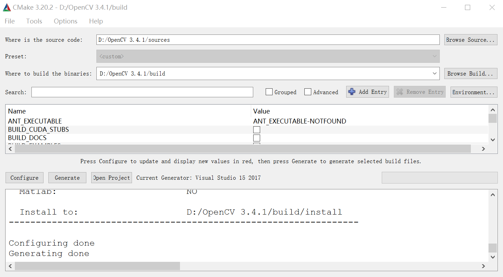

</div>

<div align = 'center'>
    Fig1
</div>


then , open the project with Visual Studio 2017 , and compile it.

4. Setting Environment variables button, click to enter "this computer"->"property"->"advance setting", as shown in the figure

 <div align = 'center'>

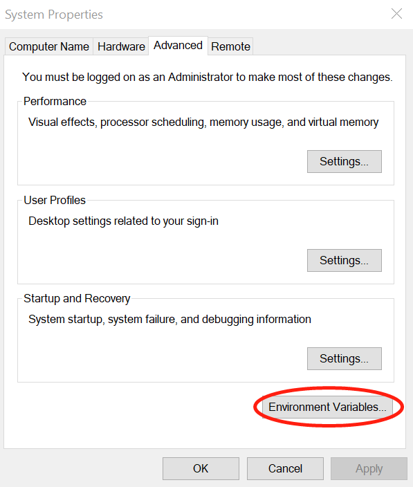

</div>

<div align = 'center'>
    Fig2
</div>


click environment variable , as shown in the figure

 <div align = 'center'>

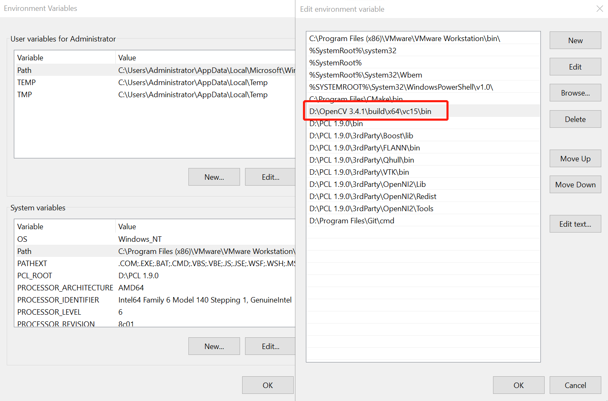

</div>

<div align = 'center'>
    Fig3
</div>


5. Configure OpenCV in the Visual Studio 2017

​       New empty project , and click to enter Property Manager, as shown in the figure

<div align = 'center'>

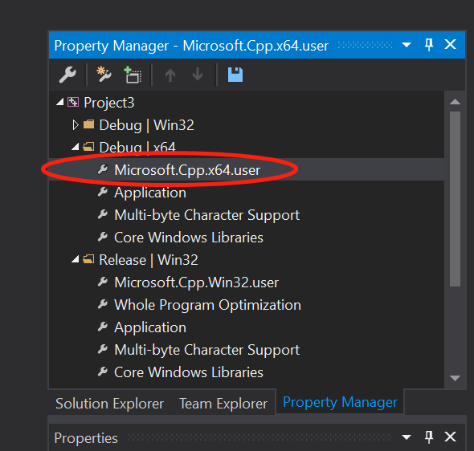

</div>

<div align = 'center'>
      Fig4
</div>

​      double click Microsoft.Cpp.x64.user, enter property page

 <div align = 'center'>


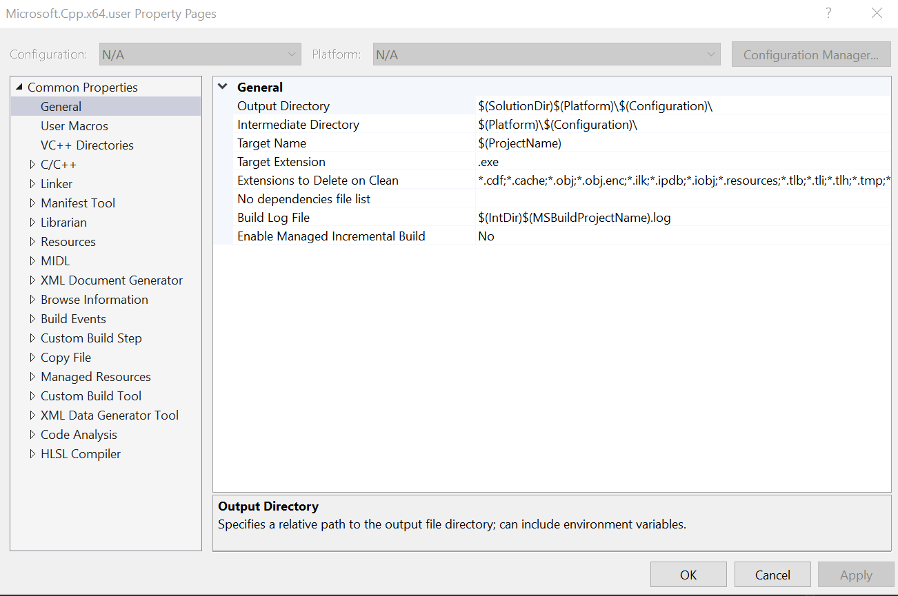

 </div>

<div align = 'center'>
    Fig5
</div>


modify Include Directories ，as shown in the figure

<div align = 'center'>

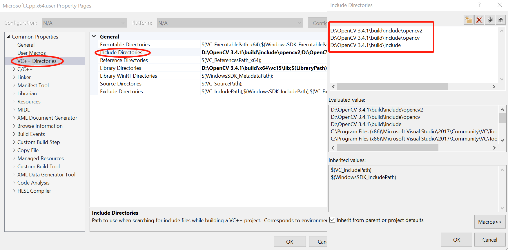

</div>

<div align = 'center'>
    Fig6
</div>


modify Library Directories，as shown in the figure

<div align = 'center'>


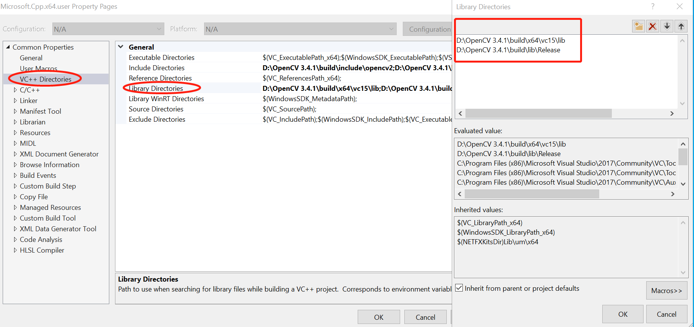

</div>

<div align = 'center'>
    Fig7
</div>


add Additional Dependencies，as shown in the figure

 <div align = 'center'>


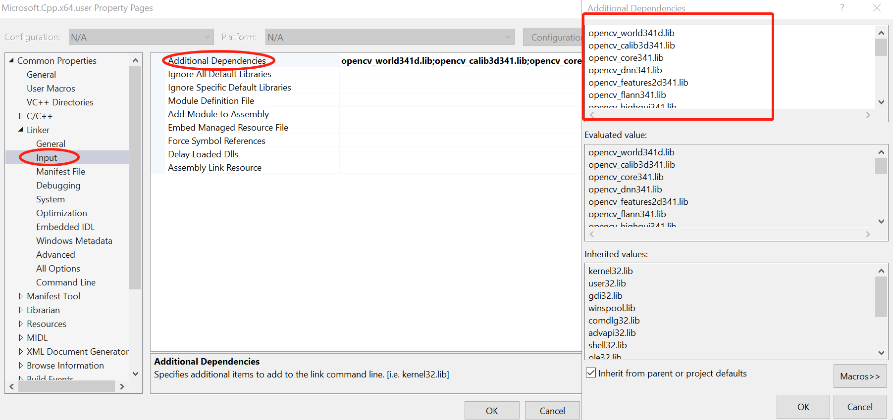

 </div>

<div align = 'center'>
    Fig8
</div>


if it is configured as Release,  just choose opencv_world341.lib.

This completes the configuration.

 

#### Install PCL (Pont Cloud library )

1. Download and install PCL-1.9.0-AllInOne-msvc2017-win64.exe，download and extract pcl-1.9.0-pdb-msvc2017-win64.zip，add the contents of the extracted folder to your PCL installation directory D:\PCL 1.9.0\bin

2. Visual Studio 2017 configure PCL1.9.0

​       Setting system envirnment variables , as shown in the figure 

 <div align = 'center'>


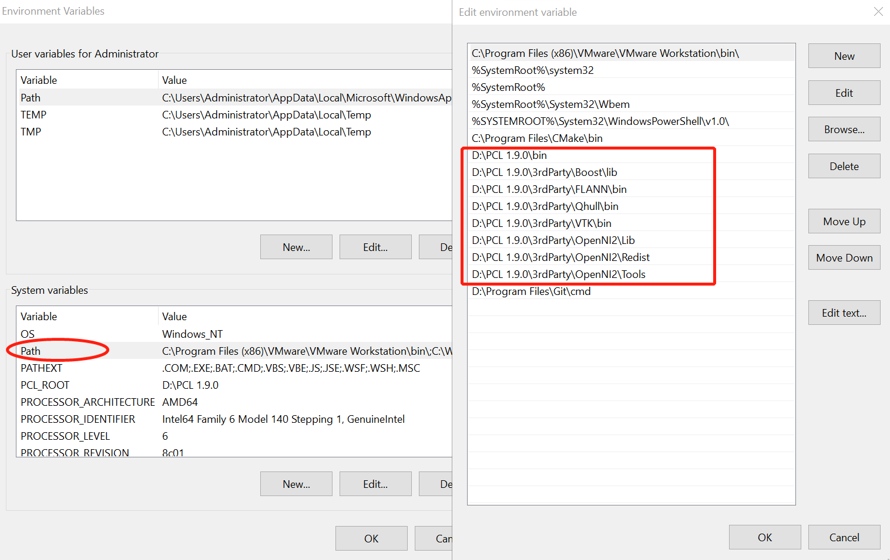

 </div>

<div align = 'center'>
    Fig9
</div>


open Visual Studio and newly build empty project ,  click to newly build Property sheet in the Property Manager, as shown in the figure 

 <div align = 'center'>


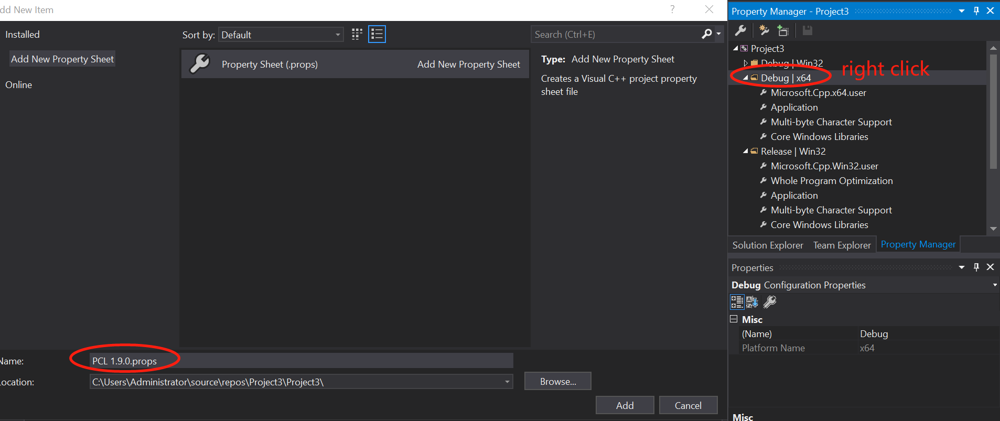

 </div>

<div align = 'center'>
    Fig10
</div>


this can add a Property sheet in the corresponding Property Manager，as shown in the figure

 <div align = 'center'>


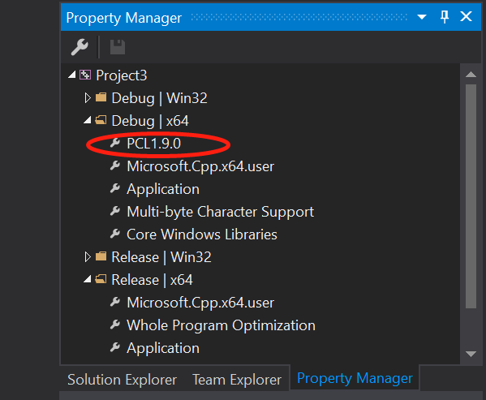

 </div>

<div align = 'center'>
    Fig11
</div>


double click to open property page , modify Include Directories 

 <div align = 'center'>


  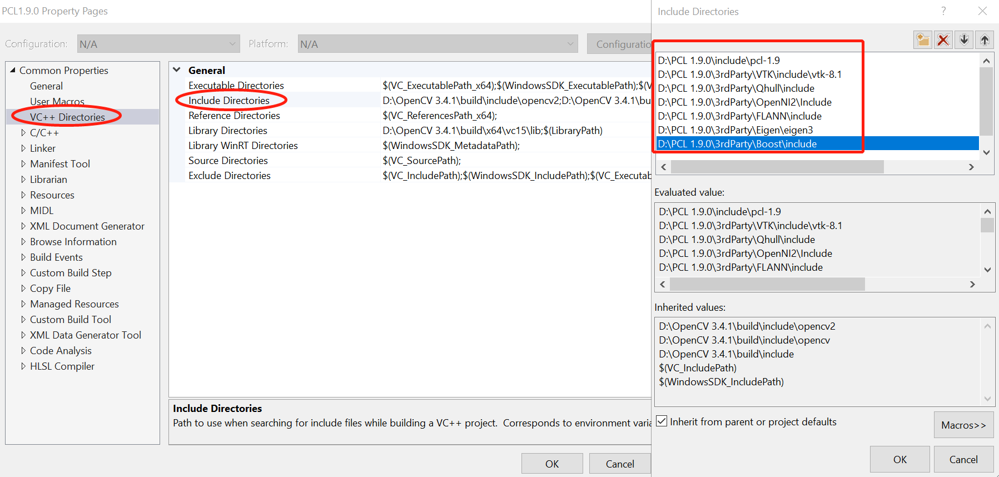

 </div>

<div align = 'center'>
    Fig12
</div>


modify Library Directories，as shown in the figure

 <div align = 'center'>


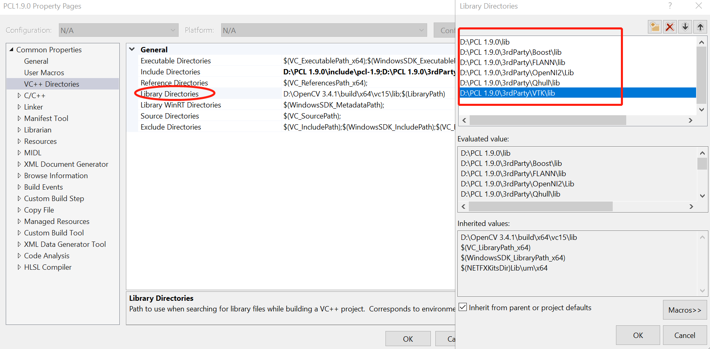

 </div>

<div align = 'center'>
    Fig13
</div>


add Additional Dependencies，as shown in the figure 

 <div align = 'center'>


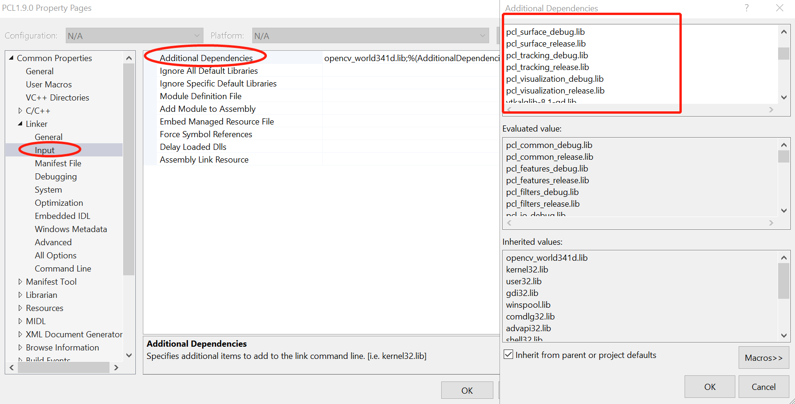

 </div>

<div align = 'center'>
    Fig14
</div>


**Dependence Item List：**

PCL:

pcl_common_debug.lib

pcl_common_release.lib

pcl_features_debug.lib

pcl_features_release.lib

pcl_filters_debug.lib

pcl_filters_release.lib

pcl_io_debug.lib

pcl_io_ply_debug.lib

pcl_io_ply_release.lib

pcl_io_release.lib

pcl_kdtree_debug.lib

pcl_kdtree_release.lib

pcl_keypoints_debug.lib

pcl_keypoints_release.lib

pcl_ml_debug.lib

pcl_ml_release.lib

pcl_octree_debug.lib

pcl_octree_release.lib

pcl_outofcore_debug.lib

pcl_outofcore_release.lib

pcl_people_debug.lib

pcl_people_release.lib

pcl_recognition_debug.lib

pcl_recognition_release.lib

pcl_registration_debug.lib

pcl_registration_release.lib

pcl_sample_consensus_debug.lib

pcl_sample_consensus_release.lib

pcl_search_debug.lib

pcl_search_release.lib

pcl_segmentation_debug.lib

pcl_segmentation_release.lib

pcl_stereo_debug.lib

pcl_stereo_release.lib

pcl_surface_debug.lib

pcl_surface_release.lib

pcl_tracking_debug.lib

pcl_tracking_release.lib

pcl_visualization_debug.lib

pcl_visualization_release.lib

pcl_common_debug.lib

pcl_common_release.lib

pcl_features_debug.lib

pcl_features_release.lib

pcl_filters_debug.lib

pcl_filters_release.lib

pcl_io_debug.lib

pcl_io_ply_debug.lib

pcl_io_ply_release.lib

pcl_io_release.lib

pcl_kdtree_debug.lib

pcl_kdtree_release.lib

pcl_keypoints_debug.lib

pcl_keypoints_release.lib

pcl_ml_debug.lib

pcl_ml_release.lib

pcl_octree_debug.lib

pcl_octree_release.lib

pcl_outofcore_debug.lib

pcl_outofcore_release.lib

pcl_people_debug.lib

pcl_people_release.lib

pcl_recognition_debug.lib

pcl_recognition_release.lib

pcl_registration_debug.lib

pcl_registration_release.lib

pcl_sample_consensus_debug.lib

pcl_sample_consensus_release.lib

pcl_search_debug.lib

pcl_search_release.lib

pcl_segmentation_debug.lib

pcl_segmentation_release.lib

pcl_stereo_debug.lib

pcl_stereo_release.lib

pcl_surface_debug.lib

pcl_surface_release.lib

pcl_tracking_debug.lib

pcl_tracking_release.lib

pcl_visualization_debug.lib

pcl_visualization_release.lib

 

VTK:

vtkalglib-8.1-gd.lib

vtkalglib-8.1.lib

vtkChartsCore-8.1-gd.lib

vtkChartsCore-8.1.lib

vtkCommonColor-8.1-gd.lib

vtkCommonColor-8.1.lib

vtkCommonComputationalGeometry-8.1-gd.lib

vtkCommonComputationalGeometry-8.1.lib

vtkCommonCore-8.1-gd.lib

vtkCommonCore-8.1.lib

vtkCommonDataModel-8.1-gd.lib

vtkCommonDataModel-8.1.lib

vtkCommonExecutionModel-8.1-gd.lib

vtkCommonExecutionModel-8.1.lib

vtkCommonMath-8.1-gd.lib

vtkCommonMath-8.1.lib

vtkCommonMisc-8.1-gd.lib

vtkCommonMisc-8.1.lib

vtkCommonSystem-8.1-gd.lib

vtkCommonSystem-8.1.lib

vtkCommonTransforms-8.1-gd.lib

vtkCommonTransforms-8.1.lib

vtkDICOMParser-8.1-gd.lib

vtkDICOMParser-8.1.lib

vtkDomainsChemistry-8.1-gd.lib

vtkDomainsChemistry-8.1.lib

vtkexoIIc-8.1-gd.lib

vtkexoIIc-8.1.lib

vtkexpat-8.1-gd.lib

vtkexpat-8.1.lib

vtkFiltersAMR-8.1-gd.lib

vtkFiltersAMR-8.1.lib

vtkFiltersCore-8.1-gd.lib

vtkFiltersCore-8.1.lib

vtkFiltersExtraction-8.1-gd.lib

vtkFiltersExtraction-8.1.lib

vtkFiltersFlowPaths-8.1-gd.lib

vtkFiltersFlowPaths-8.1.lib

vtkFiltersGeneral-8.1-gd.lib

vtkFiltersGeneral-8.1.lib

vtkFiltersGeneric-8.1-gd.lib

vtkFiltersGeneric-8.1.lib

vtkFiltersGeometry-8.1-gd.lib

vtkFiltersGeometry-8.1.lib

vtkFiltersHybrid-8.1-gd.lib

vtkFiltersHybrid-8.1.lib

vtkFiltersHyperTree-8.1-gd.lib

vtkFiltersHyperTree-8.1.lib

vtkFiltersImaging-8.1-gd.lib

vtkFiltersImaging-8.1.lib

vtkFiltersModeling-8.1-gd.lib

vtkFiltersModeling-8.1.lib

vtkFiltersParallel-8.1-gd.lib

vtkFiltersParallel-8.1.lib

vtkFiltersParallelImaging-8.1-gd.lib

vtkFiltersParallelImaging-8.1.lib

vtkFiltersPoints-8.1-gd.lib

vtkFiltersPoints-8.1.lib

vtkFiltersProgrammable-8.1-gd.lib

vtkFiltersProgrammable-8.1.lib

vtkFiltersSelection-8.1-gd.lib

vtkFiltersSelection-8.1.lib

vtkFiltersSMP-8.1-gd.lib

vtkFiltersSMP-8.1.lib

vtkFiltersSources-8.1-gd.lib

vtkFiltersSources-8.1.lib

vtkFiltersStatistics-8.1-gd.lib

vtkFiltersStatistics-8.1.lib

vtkFiltersTexture-8.1-gd.lib

vtkFiltersTexture-8.1.lib

vtkFiltersTopology-8.1-gd.lib

vtkFiltersTopology-8.1.lib

vtkFiltersVerdict-8.1-gd.lib

vtkFiltersVerdict-8.1.lib

vtkfreetype-8.1-gd.lib

vtkfreetype-8.1.lib

vtkGeovisCore-8.1-gd.lib

vtkGeovisCore-8.1.lib

vtkgl2ps-8.1-gd.lib

vtkgl2ps-8.1.lib

vtkhdf5-8.1-gd.lib

vtkhdf5-8.1.lib

vtkhdf5_hl-8.1-gd.lib

vtkhdf5_hl-8.1.lib

vtkImagingColor-8.1-gd.lib

vtkImagingColor-8.1.lib

vtkImagingCore-8.1-gd.lib

vtkImagingCore-8.1.lib

vtkImagingFourier-8.1-gd.lib

vtkImagingFourier-8.1.lib

vtkImagingGeneral-8.1-gd.lib

vtkImagingGeneral-8.1.lib

vtkImagingHybrid-8.1-gd.lib

vtkImagingHybrid-8.1.lib

vtkImagingMath-8.1-gd.lib

vtkImagingMath-8.1.lib

vtkImagingMorphological-8.1-gd.lib

vtkImagingMorphological-8.1.lib

vtkImagingSources-8.1-gd.lib

vtkImagingSources-8.1.lib

vtkImagingStatistics-8.1-gd.lib

vtkImagingStatistics-8.1.lib

vtkImagingStencil-8.1-gd.lib

vtkImagingStencil-8.1.lib

vtkInfovisCore-8.1-gd.lib

vtkInfovisCore-8.1.lib

vtkInfovisLayout-8.1-gd.lib

vtkInfovisLayout-8.1.lib

vtkInteractionImage-8.1-gd.lib

vtkInteractionImage-8.1.lib

vtkInteractionStyle-8.1-gd.lib

vtkInteractionStyle-8.1.lib

vtkInteractionWidgets-8.1-gd.lib

vtkInteractionWidgets-8.1.lib

vtkIOAMR-8.1-gd.lib

vtkIOAMR-8.1.lib

vtkIOCore-8.1-gd.lib

vtkIOCore-8.1.lib

vtkIOEnSight-8.1-gd.lib

vtkIOEnSight-8.1.lib

vtkIOExodus-8.1-gd.lib

vtkIOExodus-8.1.lib

vtkIOExport-8.1-gd.lib

vtkIOExport-8.1.lib

vtkIOExportOpenGL-8.1-gd.lib

vtkIOExportOpenGL-8.1.lib

vtkIOGeometry-8.1-gd.lib

vtkIOGeometry-8.1.lib

vtkIOImage-8.1-gd.lib

vtkIOImage-8.1.lib

vtkIOImport-8.1-gd.lib

vtkIOImport-8.1.lib

vtkIOInfovis-8.1-gd.lib

vtkIOInfovis-8.1.lib

vtkIOLegacy-8.1-gd.lib

vtkIOLegacy-8.1.lib

vtkIOLSDyna-8.1-gd.lib

vtkIOLSDyna-8.1.lib

vtkIOMINC-8.1-gd.lib

vtkIOMINC-8.1.lib

vtkIOMovie-8.1-gd.lib

vtkIOMovie-8.1.lib

vtkIONetCDF-8.1-gd.lib

vtkIONetCDF-8.1.lib

vtkIOParallel-8.1-gd.lib

vtkIOParallel-8.1.lib

vtkIOParallelXML-8.1-gd.lib

vtkIOParallelXML-8.1.lib

vtkIOPLY-8.1-gd.lib

vtkIOPLY-8.1.lib

vtkIOSQL-8.1-gd.lib

vtkIOSQL-8.1.lib

vtkIOTecplotTable-8.1-gd.lib

vtkIOTecplotTable-8.1.lib

vtkIOVideo-8.1-gd.lib

vtkIOVideo-8.1.lib

vtkIOXML-8.1-gd.lib

vtkIOXML-8.1.lib

vtkIOXMLParser-8.1-gd.lib

vtkIOXMLParser-8.1.lib

vtkjpeg-8.1-gd.lib

vtkjpeg-8.1.lib

vtkjsoncpp-8.1-gd.lib

vtkjsoncpp-8.1.lib

vtklibharu-8.1-gd.lib

vtklibharu-8.1.lib

vtklibxml2-8.1-gd.lib

vtklibxml2-8.1.lib

vtklz4-8.1-gd.lib

vtklz4-8.1.lib

vtkmetaio-8.1-gd.lib

vtkmetaio-8.1.lib

vtkNetCDF-8.1-gd.lib

vtkNetCDF-8.1.lib

vtknetcdfcpp-8.1-gd.lib

vtknetcdfcpp-8.1.lib

vtkoggtheora-8.1-gd.lib

vtkoggtheora-8.1.lib

vtkParallelCore-8.1-gd.lib

vtkParallelCore-8.1.lib

vtkpng-8.1-gd.lib

vtkpng-8.1.lib

vtkproj4-8.1-gd.lib

vtkproj4-8.1.lib

vtkRenderingAnnotation-8.1-gd.lib

vtkRenderingAnnotation-8.1.lib

vtkRenderingContext2D-8.1-gd.lib

vtkRenderingContext2D-8.1.lib

vtkRenderingContextOpenGL-8.1-gd.lib

vtkRenderingContextOpenGL-8.1.lib

vtkRenderingCore-8.1-gd.lib

vtkRenderingCore-8.1.lib

vtkRenderingFreeType-8.1-gd.lib

vtkRenderingFreeType-8.1.lib

vtkRenderingGL2PS-8.1-gd.lib

vtkRenderingGL2PS-8.1.lib

vtkRenderingImage-8.1-gd.lib

vtkRenderingImage-8.1.lib

vtkRenderingLabel-8.1-gd.lib

vtkRenderingLabel-8.1.lib

vtkRenderingLIC-8.1-gd.lib

vtkRenderingLIC-8.1.lib

vtkRenderingLOD-8.1-gd.lib

vtkRenderingLOD-8.1.lib

vtkRenderingOpenGL-8.1-gd.lib

vtkRenderingOpenGL-8.1.lib

vtkRenderingVolume-8.1-gd.lib

vtkRenderingVolume-8.1.lib

vtkRenderingVolumeOpenGL-8.1-gd.lib

vtkRenderingVolumeOpenGL-8.1.lib

vtksqlite-8.1-gd.lib

vtksqlite-8.1.lib

vtksys-8.1-gd.lib

vtksys-8.1.lib

vtktiff-8.1-gd.lib

vtktiff-8.1.lib

vtkverdict-8.1-gd.lib

vtkverdict-8.1.lib

vtkViewsContext2D-8.1-gd.lib

vtkViewsContext2D-8.1.lib

vtkViewsCore-8.1-gd.lib

vtkViewsCore-8.1.lib

vtkViewsInfovis-8.1-gd.lib

vtkViewsInfovis-8.1.lib

vtkzlib-8.1-gd.lib

vtkzlib-8.1.lib

 


Add in C/C++—>Preprocessor—>Preprocessor，as shown in the figure

​     _CRT_SECURE_NO_WARNINGS

​     _SCL_SECURE_NO_WARNINGS

​     _SILENCE_FPOS_SEEKPOS_DEPRECATION_WARNING

<div align = 'center'>

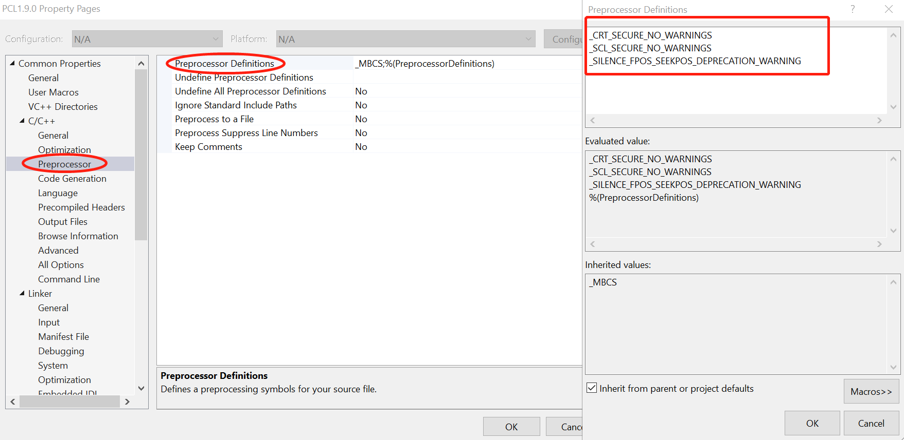

</div>

<div align = 'center'>
    Fig15
</div>


C/C++—>All Options—>SDL checks change to "No"，as shown in the figure 

<div align = 'center'>

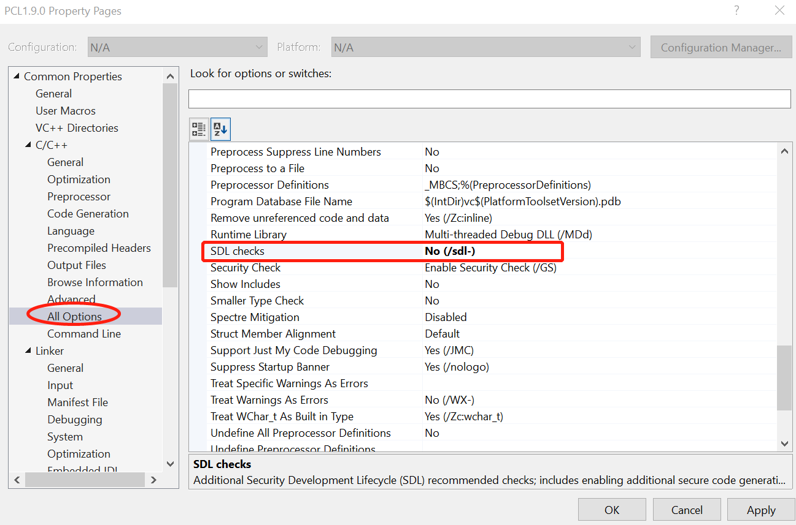

</div>

<div align = 'center'>
    Fig16
</div>


   So far, the PCL library configuration is completed.

 

#### Run demo program

 

1. Compiling SDK

   Open SDK project with Qt, click to compile and generate library files , as shown in the figure

 <div align = 'center'>


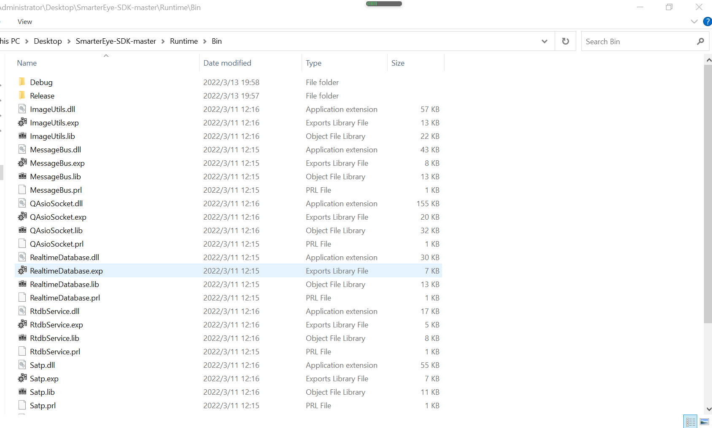

 </div>

<div align = 'center'>
    Fig17
</div>


2.  Build project for Demo

​      Demo located in Examples , open the demo of “Disparity2DepthDemo” , for instance.  Modify the    CMakeLists file reference to actual installation path , otherwise an error will be reported.

 <div align = 'center'>


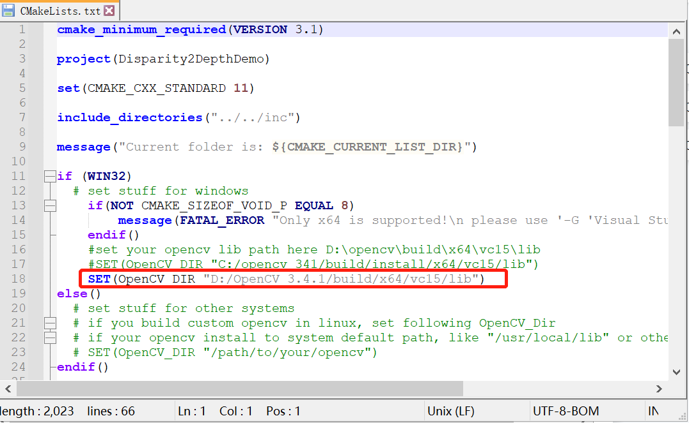

 </div>

<div align = 'center'>
    Fig18
</div>


Open Cmake-gui and add path，as shown in the figure

 <div align = 'center'>  

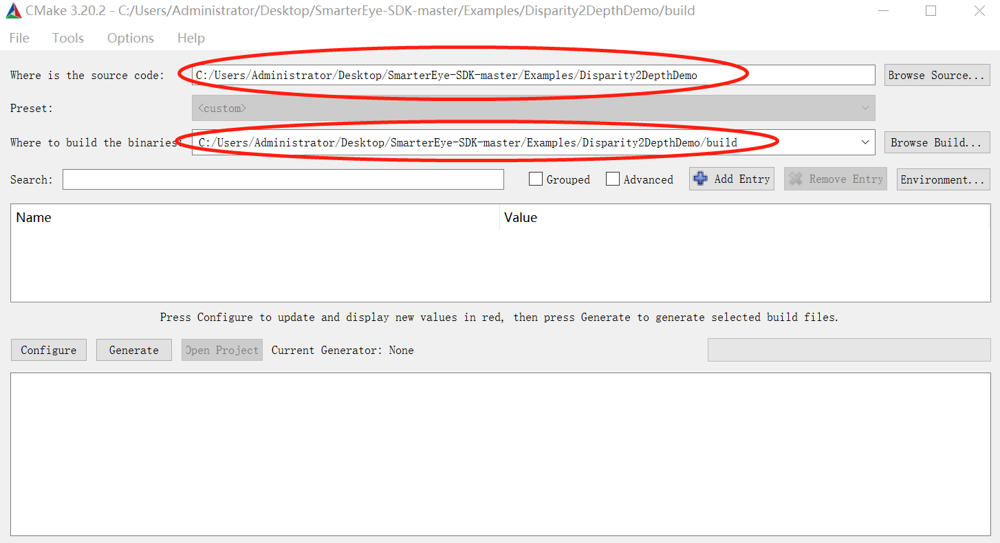

</div>

<div align = 'center'>
    Fig19
</div>


​    click Configure button ，set configuration parameter, as shown in the figure

 <div align = 'center'>

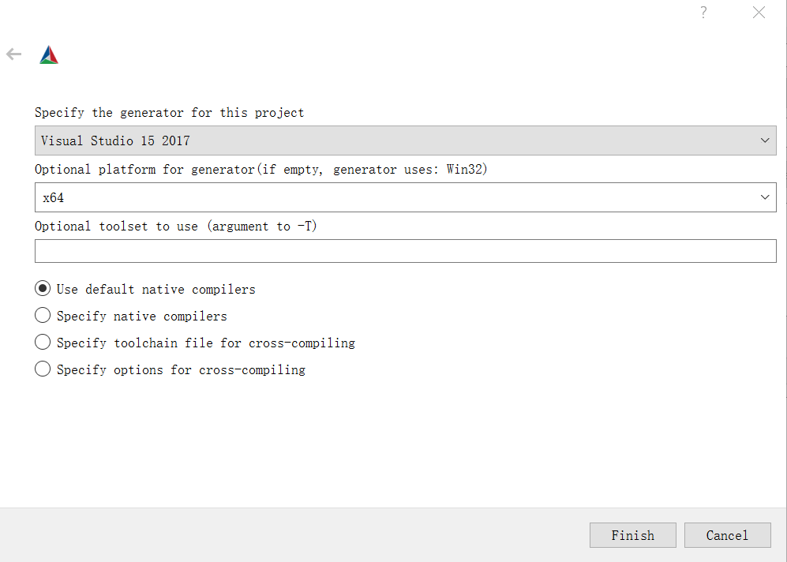

 </div>

<div align = 'center'>
    Fig20
</div>


click finish button to start build,  if showed "Configuring done",  then click generate button to generate VS project files.

3.  Compile and run

​      Open the project with Visual Studio 2017,  click to compiling, also copy the dll in SmarterEye-SDK-  master\Runtime\Bin to debug directory or Release directory, this can run demo program.

 

 

### Ubuntu 18.04 LTS (64 bit)

 

#### Open virtual machine,  or directly enter Ubuntu

#### Install g++，make application, etc. Execute  sudo apt-get install g++, sudo apt-get install make

#### Install Qt5.12

1. Download qt-opensource-linux-x64-5.12.2.run

2. Open the terminal and execute ./qt-opensource-linux-x64-5.12.2.run, then click to install

#### Install cmake3.20

1. Download cmake-3.20.2.tar.gz，open terminal and execute tar -zxvf cmake-3.20.2.tar.gz to unzip file

2. Enter the file directory，execute ./bootstrap

   **Note: If error at：Could Not found OpenSSL, execute sudo apt-get install libssl-dev to solve the problem of lack of library**

3. Execute make -j

4. Execute sudo make install

5. Execute cmake --version to verify that the installed version was successful，as shown in the figure

   <div align = 'center'>

   

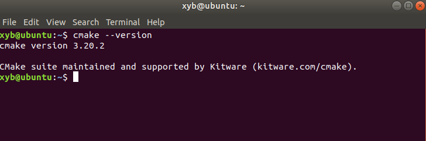

</div>

<div align = 'center'>
    Fig21
</div>


which indicates that the installation was successful.

 

#### Install OpenCV

 

1. Download and unzip opencv-3.4.1.tar.gz

2. Enter the file directory，open terminal and execute sudo apt-get install build-essential pkg-config libgtk2.0-dev libavcodec-dev libavformat-dev libjpeg-dev libswscale-dev libtiff5-dev , etc. to install dependence package

3. Execute cd build, cmake .., as shown in the figure ，which indicates that build is successful

 <div align = 'center'>


 </div>

<div align = 'center'>
    Fig22
</div>


4. make，compile too long

5. Execute sudo make install

 

#### Install PCL(Point Cloud Library)

1. Doanload and unzip pcl-pcl-1.9.0.tar.gz

2. Enter the file directory，Execute mkdir build，also execute cd build to enter build directory

3. Install dependecnde package by execute

​          sudo apt-get update

​          sudo apt-get install build-essential linux-libc-dev

​          sudo apt-get install libusb-1.0-0-dev libusb-dev libudev-dev

​          sudo apt-get install mpi-default-dev openmpi-bin openmpi-common

​          sudo apt-get install libflann1.8 libflann-dev

​          sudo apt-get install libeigen3-dev

​    **Note: if need PCLVisualizer，install OpenNI、OpenNI2.**

4. cmake ..

5. make -j

6. sudo make install

#### Ubuntu install of ROS Melodic

1. Setup sources.list


   ```
   sudo sh -c 'echo "deb http://packages.ros.org/ros/ubuntu $(lsb_release -sc) main" > /etc/apt/sources.list.d/ros-latest.list'
   ```


2. Setup keys

   ```
   sudo apt-key adv --keyserver 'hkp://keyserver.ubuntu.com:80' --recv-key C1CF6E31E6BADE8868B172B4F42ED6FBAB17C654
   ```

3. Install 

   ```
   sudo apt update
   sudo apt install ros-melodic-desktop-full
   ```

4. Dependencies for building packages

   ```
   sudo apt install python-rosdep python-rosinstall python-rosinstall-generator python-wstool build-essential
   ```

5. Initialize rosdep

   ```
   sudo rosdep init
   rosdep update
   ```
   

**Note:  **

**Due to many factors such as the network environment or the interception of overseas servers, the following problems may occur during initialization**

**(1) it showed "rosdep" command can't be found when execute "sudo rosdep init ", firstly it is recommended to replace the network. If it cannot be solved, execute "sudo gedit /etc/hosts " to open the document , add "151.101.84.133 raw.githubusercontent.com" to last line , thus add corresponding host ip for github, then re-execute command after shutup and save.**

**(2) it showed "time-out" when execute "rosdep update", this should change "DOWNLOAD_TIMEOUT = 500 (or higher)"of  three files under/usr/lib/python2.7/dist-packages/rosdep2 directory, operate as following****

```
   sudo vim /usr/lib/python2.7/dist-packages/rosdep2/gbpdistro_support.py
   
   sudo vim /usr/lib/python2.7/dist-packages/rosdep2/sources_list.py
   
   sudo vim /usr/lib/python2.7/dist-packages/rosdep2/rep3.py
```

**In the actual installation process , other problems may occur. Please treat them specifically.**

when finished, it is shown in the figure

<div align = 'center'>
   


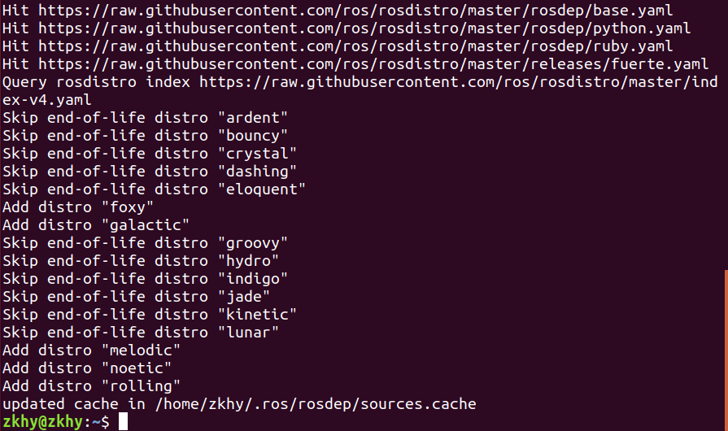

</div>


<div align = 'center'>
       Fig23
   </div>
   

6. Execute "roscore" install succeed if show as figure

   <div align = 'center'>

   

     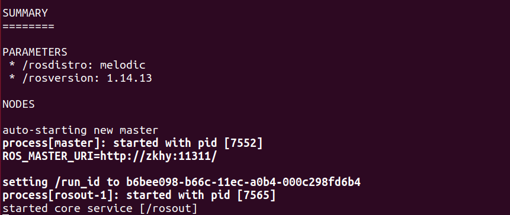

   </div>

   

   

   <div align = 'center'>
       Fig24
   </div>

   
7. Environment setup

   ```
   echo "source /opt/ros/melodic/setup.bash" >> ~/.bashrc
   source ~/.bashrc
   ```

#### Use ROS Wrapper

1. The directory structure is as follows

   ```
   <sdk>/wrapper
      └── ros
          └── src
              └── zkhy_stereo_d
                  ├── CMakeLists.txt
                  ├── launch
                  │   ├── display.launch
                  │   └── zkhy_stereo.launch
                  ├── package.xml
                  ├── rviz
                  │   └── zkhy_stereo.rviz
                  ├── src
                  │   ├── framemonitor.cpp
                  │   ├── framemonitor.h
                  │   ├── stereo_listener.cpp
                  │   ├── stereo_publisher.cpp
                  │   └── stereo_publisher.h
                  └── srv
                      ├── CameraParams.srv
                      └── RotationMatrix.srv
   ```

2. Compiling SDK

   Enter SDK directory，newly create "build", execute "cmake ..","make" to create sdk modules, which located in _output directory.

3. Compile command as follwing

   ```
    cd <sdk>/wrapper/ros/
    catkin_make
    source devel/setup.bash
   ```

4. Compile succeed, run wrapper program by executing "roslaunch zkhy_stereo_d zkhy_stereo.launch"

5. After running wrapper program, it would create following topic and service

   ```
    rostopic list
      
      /zkhy_stereo/disparity      # depth image data
          
      /zkhy_stereo/left/color     # Left camera color
      /zkhy_stereo/left/gray      # Left camera gray
      
      /zkhy_stereo/right/color    # Right camera color
      /zkhy_stereo/right/gray     # Right camera gray
      
      /zkhy_stereo/imu            # IMU data
      /zkhy_stereo/points			# PointCloud2 data
      
    rosservice list
      
      /zkhy_stereo/get_camera_params      # get camera parameter
      /zkhy_stereo/get_rotation_matrix    # get rotation matrix
      /zkhy_stereo/get_frame_rate         # get_frame_rate
   ```


#### Run demo program 

1. Direct compilation

   Under Ubuntu, execute build.sh in the scripts to compile. The compiled SDK module and demo program are automatically stored in `/SdkRelease_vX.X.X/Runtime/Bin`. Add the path of the library file to the environment variable,  eg :

   export LD_LIBRARY_PATH=/root/adas/SdkRelease_vX.X.X/Runtime/Bin`.

2. Indirect compilation

   Enter SDK directory，compiling SDK with Qt Creator，generate library files，which located in newly genarated Runtime/bin 

   **Note:  If error at :“cannot find -lGL“ with Qt Compile，then execute ln -s /usr/lib/x86_64-linux-gnu/libGL.so.1 /usr/lib/libGL.so to create link to /usr/lib for existed library file, and resatrt Qt**

   Enter Examples，enter demo program, open terminal

   mkdir build, cd build

   cmake ..

   make

   the generated executable located in Runtime/bin, as shown in the figure 

 <div align = 'center'>


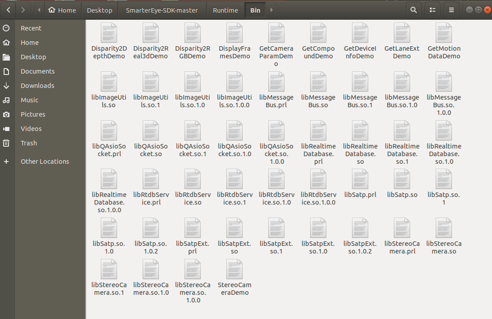

 </div>

<div align = 'center'>
    Fig25
</div>


3. Execute and run the demo as  ./Disparity2DepthDemo.


### Ubuntu 20.04 LTS (64 bit)

#### Open virtual machine,  or directly enter Ubuntu

#### Install cmake 3.20

1. Download cmake-3.20.2.tar.gz，open terminal and execute tar -zxvf cmake-3.20.2.tar.gz to unzip file

2. Enter the file directory，execute "./bootstrap"

3. Execute "make -j"

4. Execute "sudo make install"

5. Execute "cmake --version" to verify that the installed version was successful，as shown in the figure

   <div align = 'center'>

   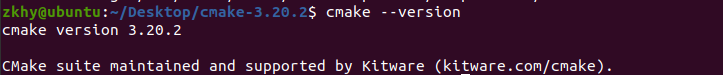

   </div>

   <div align = 'center'>
       Fig26
   </div>

#### Install Qt 5.12

1. Download qt-opensource-linux-x64-5.12.2.run

2. Open the terminal and execute ./qt-opensource-linux-x64-5.12.2.run, then click to install

   **Note：**

   ​     Install Default installation path /opt

3. Setting environment variables, execute "sudo gedit ~/.bashrc", open the document and add the following four lines

   ```
   export QTDIR=/opt/Qt5.12.2/5.12.2/gcc_64
   export PATH=$QTDIR/bin:$PATH
   export LD_PLUGINS_PATH=$QTDIR/plugins:$LD_PLUGINS_PATH
   export LD_LIBRARY_PATH=$QTDIR/lib:$LD_LIBRARY_PATH
   ```

#### Install OpenCV 4.5.1

1. Download and unzip opencv-4.5.1.tar.gz

2. Enter the file directory，open terminal and install dependence package, execute

   ```
   sudo apt-get install build-essential pkg-config libgtk2.0-dev libavcodec-dev libavformat-dev libjpeg-dev libswscale-dev libtiff5-dev
   ```

3. Execute "mkdir build", "cd build", "cmake ..", as shown in the figure, which indicates that build is successful

   <div align = 'center'>

   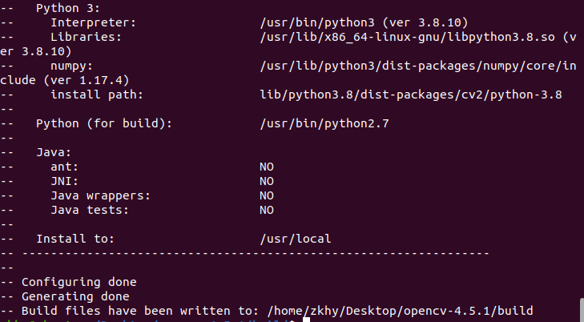

   </div>

<div align = 'center'>
    Fig27
</div>

4. Execute "make -j"

5. Execute"sudo make install"

    **Note:**

   ​     Default install path /usr/local

#### Install PCL 1.12.0

1. Download and install VTK-7.1.1

2. Download and install libpcap-1.10.1

3. Download and install merslib-0.5.3

4. Install other dependences 

   ```
   sudo apt-get update
   sudo apt-get install build-essential linux-libc-dev
   sudo apt-get install libusb-1.0-0-dev libusb-dev libudev-dev
   sudo apt-get install mpi-default-dev openmpi-bin openmpi-common
   sudo apt-get install libflann1.9 libflann-dev
   sudo apt-get install libeigen3-dev
   sudo apt-get install libboost-all-dev
   sudo apt-get install libqhull* libgtest-dev  
   sudo apt-get install freeglut3-dev pkg-config  
   sudo apt-get install libxmu-dev libxi-dev   
   sudo apt-get install mono-complete   
   sudo apt-get install libopenni-dev   
   sudo apt-get install libopenni2-dev
   ```

5. Install PCL 1.12.0

    （1）Download and unzip pcl-pcl-1.12.0.tar.gz

    （2）Enter the directory and execute"mkdir build","cd build", open terminal

    （3）Execute”cmake ..“

    （4）Execute”make“

   ​           **Note:** 

   ​    The intermediate compilation file is large, the remaining space of virtual machine disk should be not less than 15G, and the ram is preferably no less than 4G. At the same time, single core compilation must be used, otherwise there may be errors as shown in the figure below.

   <div align = 'center'>

   ​                  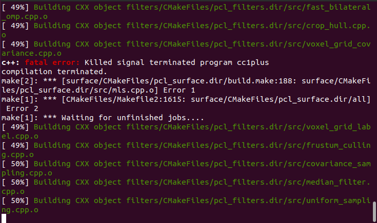

   </div>   

   <div align = 'center'>
       Fig 28
   </div>

   

   （5）Execute ”sudo make install“

   ​           **Note:**

   ​                   Default install path /usr/local

#### Install ROS Noetic

1. Setup source.list

   ```
   sudo sh -c 'echo "deb http://packages.ros.org/ros/ubuntu $(lsb_release -sc) main" > /etc/apt/sources.list.d/ros-latest.list'
   ```

2. Setup keys

   ```
   sudo apt-key adv --keyserver 'hkp://keyserver.ubuntu.com:80' --recv-key C1CF6E31E6BADE8868B172B4F42ED6FBAB17C654
   ```

3. Install

   ```
   sudo apt update
   sudo apt install ros-melodic-desktop-full
   ```

   **Note:**

   ​        The following errors may occur during installation

   <div align = 'center'>

   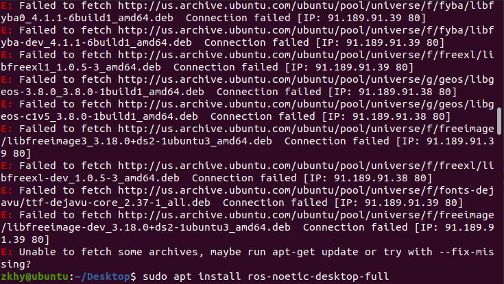

   </div>

   <div align = 'center'>
       Fig29
   </div>

   

   ​     Right click to choose "settings"->"About"->"Software Update", setting as following

   <div align = 'center'>

   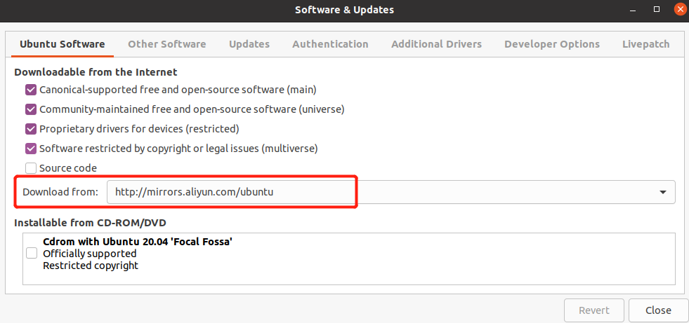</div>

   <div align = 'center'>
       Fig30
   </div>

   
4. Dependencies for building packages

   ```
   sudo apt install python-rosdep python-rosinstall python-rosinstall-generator python-wstool build-essential
   ```

5. Initialize rosdep

   ```
   sudo rosdep init
   rosdep update
   ```

​     **Note:**

​     （1）When an error occurs, you can change the network environment, such as connecting to a mobile hotspot, and try it many time.

​     （2）Execute "sudo gedit /etc/hosts", open the document and add following 5 lines

```
151.101.84.133 raw.githubusercontent.com
185.199.109.133 raw.githubusercontent.com
185.199.108.133 raw.githubusercontent.com
185.199.111.133 raw.githubusercontent.com
185.199.110.133 raw.githubusercontent.com
```

6. Setting environment variables

   ```
   echo "source /opt/ros/noetic/setup.bash" >> ~/.bashrc
   source ~/.bashrc
   ```

7. Execute "roscore",  install succeed if show as figure

   <div align = 'center'>

   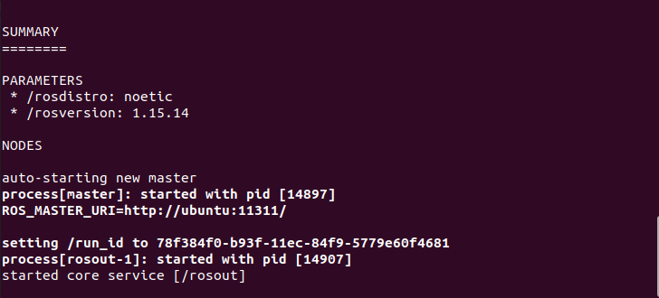

   </div>

   <div align = 'center'>
       Fig31
   </div>

   


## example description

### StereoCameraDemo
`StereoCameraDemo` covers multiple functions such as parameter request, rotation matrix request, firmware upgrade, acquisition of 3D point cloud data, etc. It is suitable for secondary development with extensive functional requirements. However, due to the complex functions, there are many things to be implemented in `mycamerahandler.cpp`.

````C++
#include <iostream>
#include <string>
#include <stdio.h>

#include "stereocamera.h"
#include "frameid.h"
#include "taskiddef.h"
#include "mycamerahandler.h"
#include "calibrationparams.h"
#include "rotationmatrix.h"

int main(int argc, char *argv[])
{
	//Call the static method connect, create a StereoCamera instance, complete the initialization, specify the IP address of the device, and establish a connection through Ethernet.
StereoCamera *cameraA = StereoCamera::connect("192.168.1.251");

	//Create an instance to receive and process camera data
MyCameraHandler *cameraHandlerA = new MyCameraHandler("camera A");

//Select the task you want to run
cameraA->enableTasks(TaskId::ObstacleTask | TaskId::LaneTask | TaskId::DisplayTask);

	//Set the ID of the data corresponding to the request, you can create multiple StereoCamera objects at the same time, and establish connections with multiple cameras.
	//By configuring different FrameIds, different types of data of the same camera can be obtained at the same time.
cameraA->requestFrame(cameraHandlerA, FrameId::Disparity );

//Another instance can be created through the same method to connect to other services
// StereoCamera *cameraB = StereoCamera::connect("192.168.20.100");
// MyCameraHandler *cameraHandlerB = new MyCameraHandler("camera B");
// cameraB->requestFrame(cameraHandlerB, FrameId::CalibRightCamera);

// prevent app to exit.
int c = 0;
while (c!= 'x')
{
switch (c)
{
case 'f':
{
			//Request camera calibration parameters for converting parallax data to distance information
StereoCalibrationParameters params;
if (cameraA->requestStereoCameraParameters(params)) {
cameraHandlerA->setStereoCalibParams(params);
} else {
std::cout << "Stereo camera parameters request failed." << std::endl;
}
}
break;
case 'r':
{
			//Request a rotation matrix for the transformation of pixel coordinates between the image coordinate system and the world coordinate system
RotationMatrix rotationMatrix;
if (cameraA->requestRotationMatrix(rotationMatrix)) {
cameraHandlerA->setRotationMatrix(rotationMatrix);
} else {
std::cout << "Rotation matrix request failed." << std::endl;
}
}
break;
case 'l':
{
        	//Get the ambient light brightness
int light = -1;
bool result = false;
result = cameraA->getAmbientLight(light);
if(result){
switch(light){
case 1:
std::cout<<"day"<<std::endl;
break;
case 2:
std::cout<<"dusk"<<std::endl;
break;
case 3:
std::cout<<"night"<<std::endl;
break;
default:
std::cout<<"unknown"<<std::endl;
}
}
}
break;
case 'z':
{
        	//Disconnect
cameraA->disconnectFromServer();
}
break;
default:
break;
}
c = getchar();
}
}
````
In `mycamerahandler.cpp`, except for the `setRotationMatrix` function, there are specific instructions in other demos, so I won't go into details.
In the sample code, `setRotationMatrix` is used to write the two matrices into the specified file after requesting the rotation matrix. The Demo can be modified according to personal needs.
````C++
void MyCameraHandler::setRotationMatrix(RotationMatrix &rotationMatrix)
{
mRotationMatrix = rotationMatrix;
FILE * fp = nullptr;
fp = fopen(kRotationMartrixFilePath.data(), "wb+");
if (!fp) {
std::cout << kRotationMartrixFilePath << "file not open" << std::endl;
return;
}

fprintf(fp, "Real3DToImage:\n");
for (int row = 0; row < 3; row++) {
for (int col = 0; col < 4; col++) {
fprintf(fp, "%e\t", mRotationMatrix.real3DToImage[col + 4 * row]);
}
fprintf(fp, "\n");
}

fprintf(fp, "ImageToReal3D:\n");
for (int row = 0; row < 3; row++) {
for (int col = 0; col < 3; col++) {
fprintf(fp, "%e\t", mRotationMatrix.imageToReal3D[col + 3 * row]);
}
fprintf(fp, "\n");
}

fclose(fp);
}
````


### Disparity2Real3dDemo - Disparity data converted to 3D point cloud data
After creating an instance in `main.cpp` to complete the initialization and successfully connecting the device through the network, set the running Task `DisplayTask` through `enableTasks`, call `requestStereoCameraParameters` to request calibration parameters, and call `requestFrame` to request image data `Disparity` .

````C++
#include <iostream>
#include <string>
#include <chrono>
#include <thread>

#include "stereocamera.h"
#include "frameid.h"
#include "taskiddef.h"
#include "mycamerahandler.h"
#include "protocol.h"
#include "calibrationparams.h"

int main(int argc, char *argv[])
{
StereoCamera *cameraA = StereoCamera::connect("192.168.1.251");
MyCameraHandler *cameraHandlerA = new MyCameraHandler("camera A");

while (!cameraA->getProtocol()->isConnected()) {
printf("connecting...\n");
std::this_thread::sleep_for(std::chrono::seconds(1));
}

std::this_thread::sleep_for(std::chrono::seconds(3));

cameraA->enableTasks(TaskId::DisplayTask);

StereoCalibrationParameters params;
cameraA->requestStereoCameraParameters(params);
cameraHandlerA->setStereoCalibParams(params);

cameraA->requestFrame(cameraHandlerA, FrameId::Disparity);

int c = 0;
while (c!= 'x')
{
c = getchar();
}
}
````
To realize the function of converting parallax data into 3D point cloud data, it is also necessary to implement in `mycamerahandler.cpp`:

1. `setStereoCalibParams`, assign the requested camera calibration parameters to the variable `mStereoCalibrationParameters` for subsequent data conversion.

````C++
void MyCameraHandler::setStereoCalibParams(StereoCalibrationParameters &params)
{
mStereoCalibrationParameters = params;
mIsCalibParamReady = true;
std::cout << "calib params is ready!!!" << std::endl;
}
````
2. `handleRawFrame` inherits from the class `FrameHandler`, and handles the raw data of the `RawImageFrame` type structure from the device side, which may be simple image data, the result of algorithm processing, or the composite data superimposed by the two.

````C++
void MyCameraHandler::handleRawFrame(const RawImageFrame *rawFrame)
{
std::cout << mName
<< ", got image, id: " << rawFrame->frameId
<< " , time stamp: " << rawFrame->time
<< std::endl;
              
processFrame(rawFrame->frameId, (char*)rawFrame + sizeof(RawImageFrame),
rawFrame->dataSize, rawFrame->width, rawFrame->height, rawFrame->format);
}
````
3. `processFrame` is the next processing logic, users can perform different processing according to their own needs. The differences between the demos are also generated from the processing logic.
According to the function we want to achieve - disparity to distance, choose the disparity data whose `frameId` is `Disparity` and combine the camera calibration parameters and the number of decimal places of the disparity data (obtained by `getDisparityBitNum`) for further processing. If the previous request for camera calibration parameters fails, the subsequent processing is meaningless.

````C++
void MyCameraHandler::processFrame(int frameId, char *image, uint32_t dataSize, int width, int height, int frameFormat)
{
switch(frameId) {
case FrameId::Disparity:
{
int bitNum = DisparityConvertor::getDisparityBitNum(frameFormat);
if (mIsCalibParamReady) {
handleDisparityByLookupTable((unsigned char *)image, width, height, bitNum);
} else {
std::cout << "calib params is not ready!!!" << std::endl;
}
}
break;
default:
break;
}
}
````
Here are two methods to choose from `handleDisparityByLookupTable` and `handleDisparityPointByPoint`.

`handleDisparityByLookupTable` is to complete data conversion by looking up the table:

1. First, generate lookup tables in three directions of x, y, and z through the three interfaces `generateLookUpTableX`, `generateLookUpTableY` and `generateLookUpTableZ` respectively, which can only be generated once during the demo running.
2. Call the interface `getWholeXDistanceByLookupTable` to output the image data, calibration data and the x-direction lookup table, and you can get the coordinate values of all pixels in the full-frame image in the x-direction. In the same way, y and z coordinate values are obtained through `generateLookUpTableY` and `generateLookUpTableZ`. So far, the conversion of full-frame image parallax data into distance information has been completed.
3. In the Demo, the converted 3D point cloud data is written into the specified file as a reference, and it is written only once, and can be modified according to personal needs.

````c++
void MyCameraHandler::handleDisparityByLookupTable(unsigned char *image, int width, int height, int bitNum)
{
std::cout << "width: " << width << ", height: " << height << std::endl;

static float *lookUpTableX = new float[kDisparityCount*(int)pow(2, bitNum)*width];
static float *lookUpTableY = new float[kDisparityCount*(int)pow(2, bitNum)*height];
static float *lookUpTableZ = new float[kDisparityCount*(int)pow(2, bitNum)];
if(!mIsLookupTableGenerated) {
DisparityConvertor::generateLookUpTableX(width, bitNum, mStereoCalibrationParameters.Tx, mStereoCalibrationParameters.cx, lookUpTableX);
DisparityConvertor::generateLookUpTableY(height, bitNum, mStereoCalibrationParameters.Tx, mStereoCalibrationParameters.cy, lookUpTableY);
DisparityConvertor::generateLookUpTableZ(bitNum, mStereoCalibrationParameters.Tx, mStereoCalibrationParameters.focus, lookUpTableZ);
mIsLookupTableGenerated = true;
}

float *xDistance = new float[width*height];
DisparityConvertor::getWholeXDistanceByLookupTable(image, width, height, bitNum, lookUpTableX, xDistance);
float *yDistance = new float[width*height];
DisparityConvertor::getWholeYDistanceByLookupTable(image, width, height, bitNum, lookUpTableY, yDistance);
float *zDistance = new float[width*height];
DisparityConvertor::getWholeZDistanceByLookupTable(image, width, height, lookUpTableZ, zDistance);

static int index = 0;
index++;
FILE * fp = nullptr;
if (index == 1) {
fp = fopen(k3dByLookUpTableFilePath.data(), "wb+");
if (!fp) {
std::cout << k3dByLookUpTableFilePath << "file not open" << std::endl;
return;
}
}
for(int i = 0; i < width*height; i++) {
float x, y, z;
x = xDistance[i];
y = yDistance[i];
z = zDistance[i];
if((fabs(x) > 200000.0f)||(fabs(y) > 200000.0f)||(fabs(z) > 200000.0f)) {
x = 0.0f;
y = 0.0f;
z = 0.0f;
}
if (index == 1) {
fprintf(fp, "%f %f %f %d\n", x, y, z, i);
}
}
if (index == 1) {
fclose(fp);
}

delete [] xDistance;
delete [] yDistance;
delete [] zDistance;
}
````
`handleDisparityPointByPoint` is in pixels, and obtains the coordinate value of each point in the world coordinate system one by one:
1. Since our disparity data is not stored in `float` type, we first need to call `convertDisparity2FloatFormat` to convert the disparity data to float type for further processing.
2. Use the converted parallax data, camera calibration parameters, and the coordinates of the pixel on the image `(posX, posY)` as input parameters, call `getPointXYZDistance` to get the coordinate value of the pixel in the world coordinate system` (x, y, z)` .
3. Perform the above processing on all `(width×height)` pixels of the full-frame image, that is, to obtain the coordinate values of all the pixels of the full-frame image in the world coordinate system. The conversion of disparity data to distance information is complete.
4. The 3D point cloud data is stored once for reference in the Demo, and can be modified according to personal needs.

````C++
void MyCameraHandler::handleDisparityPointByPoint(unsigned char *image, int width, int height, int bitNum)
{
std::cout << "width: " << width << ", height: " << height << std::endl;

static float *floatData = new float[width * height];
DisparityConvertor::convertDisparity2FloatFormat(image, width, height, bitNum, floatData);

static int index = 0;
index++;
FILE * fp = nullptr;
if (index == 1) {
fp = fopen(k3dPointByPointFilePath.data(), "wb+");
if (!fp) {
std::cout << k3dPointByPointFilePath << "file not open" << std::endl;
return;
}
}

for(int posY = 0; posY < height; posY++) {
for(int posX = 0; posX < width; posX++) {
float x, y, z;
DisparityConvertor::getPointXYZDistance(image, width, height, bitNum, mStereoCalibrationParameters.Tx, mStereoCalibrationParameters.focus, mStereoCalibrationParameters.cx, mStereoCalibrationParameters.cy, posX, posY, x, y, z);

if((fabs(x) > 200000.0f)||(fabs(y) > 200000.0f)||(fabs(z) > 200000.0f)) {
x = 0.0f;
y = 0.0f;
z = 0.0f;
}
if (index == 1) {
fprintf(fp, "%f %f %f %d\n", x, y, z, (posY * width + posX));
}
}
}
if (index == 1) {
fclose(fp);
}
}
````

### Disparity2RGBDemo - Pseudocolor rendering of disparity data
According to the difference of disparity values in different regions in the image, pseudo-color rendering is performed to achieve the purpose of visually distinguishing.
The selection of `TaskId` and `FrameId` in `main.cpp` is the same as `Disparity2Real3dDemo`, but does not require camera calibration parameters.
````C++
#include <iostream>
#include <string>
#include <cstdio>

#include "stereocamera.h"
#include "frameid.h"
#include "taskiddef.h"
#include "mycamerahandler.h"

int main(int argc, char *argv[])
{
StereoCamera *cameraA = StereoCamera::connect("192.168.1.251");
MyCameraHandler *cameraHandlerA = new MyCameraHandler("camera A");

cameraA->enableTasks(TaskId::DisplayTask);

cameraA->requestFrame(cameraHandlerA, FrameId::Disparity);

int c = 0;
while (c!= 'x')
{
c = getchar();
}
}
````
`mycamerahandler.cpp` also needs to implement `handleRawFrame` and `processFrame`, but the processing logic of `processFrame` is different.
According to the required implementation function - disparity data pseudo-color rendering, select the disparity data whose `FrameId` is `Disparity` for processing.
After calling `convertDisparity2FloatFormat` combined with the number of decimal places occupied by the disparity data (obtained by `getDisparityBitNum`) to convert the disparity data to `float` type, the pseudo-color rendering of the disparity data can be completed through the interface `convertDisparity2RGB`.
The rendered data is not displayed or stored in the Demo, which can be modified according to individual needs.

````C++
void MyCameraHandler::processFrame(int frameId, const unsigned char *image,int64_t time, int width, int height, int frameFormat)
{
switch(frameId) {
case FrameId::Disparity:
{
int bitNum = DisparityConvertor::getDisparityBitNum(frameFormat);
static unsigned char *rgbBuf = new unsigned char[width * height * 3];
static float *floatData = new float[width * height];

DisparityConvertor::convertDisparity2FloatFormat(image, width, height, bitNum, floatData);
DisparityConvertor::convertDisparity2RGB(floatData, width, height, kMinValidDisparityValue, kMaxValidDisparityValue, rgbBuf);
}
break;
default:
break;
}
}
````
### GetCameraParamDemo - get camera calibration parameters
Acquisition of camera calibration parameters without requesting image data. In `main.cpp`, create an instance and complete the initialization, confirm that the connection is successful, wait for 3s (data loading), and call the `requestStereoCameraParameters` interface to obtain the camera's calibration parameters from the device side. The `dumpCameraParams` function only prints the requested parameters, which can be modified according to personal needs.
````C++
#include <chrono>
#include <thread>
#include <cstdio>

#include "stereocamera.h"
#include "protocol.h"
#include "calibrationparams.h"

void dumpCameraParams(const StereoCalibrationParameters &params)
{
printf("************ Camera params ************\n");
printf("Focus: %e pixel\n", params.focus);
printf("Optical center X: %e pixel\n", params.cx);
printf("Optical center Y: %e pixel\n", params.cy);
printf("R-vector roll: %e rad\n", params.RRoll);
printf("R-vector pitch: %e rad\n", params.RPitch);
printf("R-vector yaw: %e rad\n", params.RYaw);
printf("Translation x: %e mm\n", params.Tx);
printf("Translation y: %e mm\n", params.Ty);
printf("Translation z: %e mm\n", params.Tz);
printf("****************************************\n");
}

int main(int argc, char *argv[])
{
StereoCamera *camera = StereoCamera::connect("192.168.1.251");

while (!camera->isConnected()) {
printf("connecting...\n");
std::this_thread::sleep_for(std::chrono::seconds(1));
}

std::this_thread::sleep_for(std::chrono::seconds(3)); // wait for rtdb load

StereoCalibrationParameters params;
camera->requestStereoCameraParameters(params);

dumpCameraParams(params);

int c = 0;
while (c!= 'x')
{
c = getchar();
}
}
````

### GetCompoundDemo——The obstacle information is merged with the left image to draw the overlay effect
After creating an instance in `main.cpp` to complete the initialization and successfully connecting the device through the network, set the running task `DisplayTask | ObstacleTask` through `enableTasks`, and call `requestFrame` to request image data `Compound`. `ObstacleTask` is the basis for the operation of the obstacle extraction algorithm, and `Compound` is the left calibration map data superimposed with the processing results of the obstacle algorithm.
````C++
#include <iostream>
#include <string>

#include "stereocamera.h"
#include "frameid.h"
#include "taskiddef.h"
#include "mycamerahandler.h"
#include "calibrationparams.h"

int main(int argc, char *argv[])
{
StereoCamera *cameraA = StereoCamera::connect("192.168.1.251");
MyCameraHandler *cameraHandlerA = new MyCameraHandler("camera A");

cameraA->enableTasks(TaskId::DisplayTask | TaskId::ObstacleTask);

cameraA->requestFrame(cameraHandlerA, FrameId::Compound);

int c = 0;
while (c!= 'x')
{
c = getchar();
}
}
````
The processing of `Compound` is implemented in the `processFrame` function of `mycamerahandler.cpp`, and the parameters are slightly different from the processing of parallax data. First convert the grayscale data to RGB format through `imageGrayToRGB`, in order to realize the color rendering of the final obstacle frame. Then call the `paintObstacle` interface to complete the drawing of the overlay effect. The `extended` used is essentially the extraction result data for the stripped obstacles. The sample code does not display or store the processed data, and can be modified according to individual needs.

````C++
#include <iostream>
#include <string>

#include "mycamerahandler.h"
#include "satpext.h"
#include "frameid.h"
#include "roadwaypainter.h"
#include "obstaclepainter.h"

MyCameraHandler::MyCameraHandler(std::string name):
mName(name)
{}

void MyCameraHandler::handleRawFrame(const RawImageFrame *rawFrame)
{
// std::cout << mName
// << ", got image, id: " << rawFrame->frameId
// << " , time stamp: " << rawFrame->time
// << std::endl;

processFrame(rawFrame->frameId, (char*)rawFrame + sizeof(RawImageFrame), (char*)rawFrame + rawFrame->dataSize + sizeof(RawImageFrame), rawFrame->time, rawFrame->width, rawFrame->height);
}

void MyCameraHandler::processFrame(int frameId, char *image, char *extended, int64_t time, int width, int height)
{
switch(frameId) {
case FrameId::Compound:
{
static unsigned char *rgbBuf = new unsigned char[width * height * 3];
RoadwayPainter::imageGrayToRGB((unsigned char*)image, rgbBuf, width, height);
ObstaclePainter::paintObstacle(extended, rgbBuf, width, height, true, false);
}
break;
default:
break;
}
}
````

### GetLaneExtDemo——The lane line information is merged with the left image to draw the overlay effect

After creating an instance in `main.cpp` to complete the initialization and successfully connecting the device through the network, set the running task `DisplayTask | LaneTask` through `enableTasks`, and call `requestFrame` to request the image data `LaneExt`. `LaneTask` is the basis for the operation of the lane line recognition algorithm, and `LaneExt` is the left calibration map data superimposed with the processing results of the lane line algorithm.
````C++
#include <iostream>
#include <string>

#include "stereocamera.h"
#include "frameid.h"
#include "taskiddef.h"
#include "mycamerahandler.h"

int main(int argc, char *argv[])
{
StereoCamera *cameraA = StereoCamera::connect("192.168.1.251");
MyCameraHandler *cameraHandlerA = new MyCameraHandler("camera A");

cameraA->enableTasks(TaskId::DisplayTask | TaskId::LaneTask);

cameraA->requestFrame(cameraHandlerA, FrameId::LaneExt);

int c = 0;
while (c!= 'x')
{
c = getchar();
}
}
````
The processing of `LaneExt` is implemented in the `processFrame` function of `mycamerahandler.cpp`. First convert the grayscale data to RGB format through `imageGrayToRGB`, in order to realize the color rendering of the final obstacle frame. Then call the `paintRoadway` interface to complete the drawing of the overlay effect. The `extended` used is essentially the stripped lane line result data. In addition to drawing, it can also be parsed and printed according to requirements. The sample code does not display or store the processed data, and can be modified according to individual needs.

````C++
#include <iostream>
#include <string>

#include "mycamerahandler.h"
#include "satpext.h"
#include "frameid.h"
#include "LdwDataInterface.h"
#include "roadwaypainter.h"

MyCameraHandler::MyCameraHandler(std::string name):
mName(name)
{}

void MyCameraHandler::handleRawFrame(const RawImageFrame *rawFrame)
{
// std::cout << mName
// << ", got image, id: " << rawFrame->frameId
// << " , time stamp: " << rawFrame->time
// << std::endl;

processFrame(rawFrame->frameId, (char*)rawFrame + sizeof(RawImageFrame), (char*)rawFrame + rawFrame->dataSize + sizeof(RawImageFrame), rawFrame->time, rawFrame->width, rawFrame->height);
}

void MyCameraHandler::processFrame(int frameId, char *image, char *extended, int64_t time, int width, int height)
{
switch(frameId) {
case FrameId::LaneExt:
{
FrameDataExtHead *header = reinterpret_cast<FrameDataExtHead *>(extended);
LdwDataPack *ldwDataPack = (LdwDataPack *)header->data;
std::cout << "ldw degree is: " << ldwDataPack->roadway.left_Lane.left_Boundary.degree << std::endl;

static unsigned char *rgbBuf = new unsigned char[width * height * 3];
RoadwayPainter::imageGrayToRGB((unsigned char*)image, rgbBuf, width, height);
mIsLaneDetected = RoadwayPainter::paintRoadway(header->data, rgbBuf, width, height);
}
break;
default:
break;
}
}
````

### DisplayFramesDemo - Display image data (left, right, disparity)
After creating an instance in `main.cpp` to complete the initialization and successfully connecting the device through the network, call `requestFrame` to request image data `CalibLeftCamera` `CalibRightCamera` `Disparity`. You can choose to request one or more image data. It is worth noting that this sample code relies on the OpenCV environment.
````C++
#include <iostream>
#include <opencv2/highgui.hpp>

#include "stereocamera.h"
#include "framemonitor.h"
#include "frameid.h"
#include "taskiddef.h"

/**
* @brief main
* @note the sdk base on qt
* @note on linux x86 desktop platform, there are some problems to use opencv_highgui module without qt event loop
* @note here, calling functions of highgui in qt event loop is correct, called by invokeInLoopThread() by class StereoCamera
*/

int main(int argc, char *argv[])
{
StereoCamera *camera = StereoCamera::connect("192.168.1.251");
std::unique_ptr<FrameMonitor> frameMonitor(new FrameMonitor);

camera->enableTasks(TaskId::DisplayTask);
camera->requestFrame(frameMonitor.get(), FrameId::CalibLeftCamera | FrameId::CalibRightCamera | FrameId::Disparity);

std::function<int()> draw_func = [&frameMonitor]() -> int {
const cv::Mat &leftFrame = frameMonitor->getFrameMat(FrameId::CalibLeftCamera);
const cv::Mat &rightFrame = frameMonitor->getFrameMat(FrameId::CalibRightCamera);
const cv::Mat &disparity = frameMonitor->getFrameMat(FrameId::Disparity);

if (!leftFrame.empty()) {
cv::imshow("Left", leftFrame);
}
        
if (!rightFrame.empty()) {
cv::imshow("Right", rightFrame);
}

if (!disparity.empty()) {
cv::imshow("Disparity", disparity);
}

return cv::waitKey(80);
};

camera->invokeInLoopThread([]{
cv::namedWindow("Left");
cv::namedWindow("Right");
cv::namedWindow("Disparity");
});

// main thread loop for drawing images
while (true) {
frameMonitor->waitForFrames(); // wait for frames ready

int key = 0;
camera->invokeInLoopThread([&key, &draw_func]{
key = draw_func();
});

if (key == 27) {
// press Esc to close
break;
}
}

camera->invokeInLoopThread([]{
cv::destroyAllWindows();
});

return 0;
}
````
The processing of image data is implemented in the `processFrame` function of `framemonitor.cpp`. By judging `FrameId`, image data with different IDs can be differentiated. The `loadFrameData2Mat` function implements loading `Frame` into `Mat`, and the main function calls `cv::imshow` to implement the image display function. It supports color rendering of parallax data, and also supports displaying as grayscale images, which can be achieved by modifying Demo.

````C++
void FrameMonitor::processFrame(const RawImageFrame *rawFrame)
{
switch (rawFrame->frameId) {
case FrameId::Disparity:
{
// only for FrameFormat::Disparity16, bitNum = 5
std::lock_guard<std::mutex> lock(mMutex);
loadFrameData2Mat(rawFrame, mDisparityMat);

// std::cout << "update disparity mat" << std::endl;
mFrameReadyFlag = true;
mFrameReadyCond.notify_one();
}
break;
case FrameId::CalibLeftCamera:
{
std::lock_guard<std::mutex> lock(mMutex);
loadFrameData2Mat(rawFrame, mLeftMat);

// std::cout << "update left mat" << std::endl;
mFrameReadyFlag = true;
mFrameReadyCond.notify_one();
}
break;
case FrameId::CalibRightCamera:
{
std::lock_guard<std::mutex> lock(mMutex);
loadFrameData2Mat(rawFrame, mRightMat);

// std::cout << "update right mat" << std::endl;
mFrameReadyFlag = true;
mFrameReadyCond.notify_one();
}
break;
}
}
````

````C++
void FrameMonitor::loadFrameData2Mat(const RawImageFrame *frameData, cv::Mat &dstMat)
{
int width = frameData->width;
int height = frameData->height;
const unsigned char *imageData = frameData->image;

switch (frameData->format) {
case FrameFormat::Disparity16:
{
// DisparityConvertor::convertDisparity2FloatFormat(imageData, width, height, 5, mDisparityFloatData.get());
// DisparityConvertor::convertDisparity2RGB(mDisparityFloatData.get(), width, height, 0, 45, mRgbBuffer.get());
// cv::Mat dispMat(height, width, CV_8UC3, mRgbBuffer.get());
// cv::resize(dispMat, dstMat, dstMat.size());

cv::Mat dispMat(height, width, CV_16U, (void*)imageData);
cv::resize(dispMat, dstMat, dstMat.size());
cv::normalize(dstMat, dstMat, 0, 255, cv::NORM_MINMAX, CV_8U);
}
break;
case FrameFormat::Gray:
{
cv::Mat grayMat(height, width, CV_8UC1, (void*)imageData);
cv::resize(grayMat, dstMat, dstMat.size());
}
break;
case FrameFormat::YUV422:
{
YuvToRGB::YCbYCr2Rgb(imageData, (char *)mRgbBuffer.get(), width, height);
cv::Mat yuv422Mat(height, width, CV_8UC3, mRgbBuffer.get());
cv::resize(yuv422Mat, dstMat, dstMat.size());
cv::cvtColor(dstMat, dstMat, CV_RGB2BGR);
}
break;
case FrameFormat::YUV422Plannar:
{
YuvToRGB::YCbYCrPlannar2Rgb(imageData, (char *)mRgbBuffer.get(), width, height);
cv::Mat yuv422PlannarMat(height, width, CV_8UC3, mRgbBuffer.get());
cv::resize(yuv422PlannarMat, dstMat, dstMat.size());
cv::cvtColor(dstMat, dstMat, CV_RGB2BGR);
}
break;
}
}
````
### GetMotionDataDemo - Get IMU data
The acceleration, angular velocity range, and acquisition frequency can be set by modifying the sample code. At present, `motion data` is sent from the device side as the additional data of the left calibration map, so it is necessary to request the left calibration map.
````C++
#include <iostream>
#include <string>
#include <chrono>
#include <thread>
#include "stereocamera.h"
#include "frameid.h"
#include "taskiddef.h"
#include "mycamerahandler.h"

int main(int argc, char *argv[])
{
StereoCamera *cameraA = StereoCamera::connect("192.168.1.251");
MyCameraHandler *cameraHandlerA = new MyCameraHandler("camera A");

bool isConnected = false;
while (!isConnected) {
printf("connecting...\n");
isConnected = cameraA->isConnected();
std::this_thread::sleep_for(std::chrono::seconds(1));
}

//get imu parameters
std::cout << "accel range:" << cameraA->getImuAccelRange() << std::endl;
std::cout << "rotation range:" << cameraA->getImuRotationRange() << std::endl;
std::cout << "frequence::" << cameraA->getImuReadFrequence() << std::endl;

//set imu parameters
cameraA->setImuAccelRange(4); //2,4,8,16;default is 4
cameraA->setImuRotationRange(500); //250,500,1000,2000;default is 500
cameraA->setImuReadFrequence(100); //10-100Hz;default is 100Hz

cameraA->requestFrame(cameraHandlerA, FrameId::CalibLeftCamera);
cameraA->enableMotionData(true);
MotionData data;
while (true) {
std::this_thread::sleep_for(std::chrono::milliseconds(80));
int size = cameraHandlerA->getMotionListSize();
for (int index = 0;index < size;index++) {
cameraHandlerA->readMotionData(data);
std::cout << "accel x:" << data.accelX << "g" << std::endl;
std::cout << "accel y:" << data.accelY << "g" << std::endl;
std::cout << "accel z:" << data.accelZ << "g" << std::endl;
std::cout << "gyro x:" << data.gyroX << "deg/s" << std::endl;
std::cout << "gyro y:" << data.gyroY << "deg/s" << std::endl;
std::cout << "gyro z:" << data.gyroZ << "deg/s" << std::endl;
std::cout << "time stamp:" << data.timestamp << "ms" << std::endl;
}
}
}

````

### PointCloudDemo - Demo integrating PCL
PCL is integrated to support 3D reconstruction using PCL after obtaining parallax data from the device. This sample code depends on the OpenCV environment
````C++
#include <iostream>
#include <string>
#include <chrono>
#include <thread>

#include "stereocamera.h"
#include "frameid.h"
#include "taskiddef.h"
#include "mycamerahandler.h"
#include "protocol.h"
#include "calibrationparams.h"
#include "pcviewer.h"

int main(int argc, char *argv[])
{
StereoCamera *cameraA = StereoCamera::connect("192.168.1.251");
MyCameraHandler *cameraHandlerA = new MyCameraHandler("camera A");

while (!cameraA->getProtocol()->isConnected()) {
std::cout << "connecting..." << std::endl;
std::this_thread::sleep_for(std::chrono::seconds(1));
}

std::this_thread::sleep_for(std::chrono::seconds(3));

cameraA->enableTasks(TaskId::DisplayTask);

StereoCalibrationParameters params;
cameraA->requestStereoCameraParameters(params);
cameraHandlerA->setStereoCalibParams(params);
cameraA->requestFrame(cameraHandlerA, FrameId::Disparity);

std::shared_ptr<PCViewer> viewer(new PCViewer(true));

// main loop for showing point cloud
while (!viewer->wasStopped()) {
auto cloud = cameraHandlerA->getCloud();
viewer->update(cloud);
}

std::cout << "stopped" << std::endl;
viewer->close();

cameraA->disconnectFromServer();
delete cameraA;
delete cameraHandlerA;

return 0;
}

````
### GetDeviceInfoDemo - get device information
Access to device information without requesting image data. In `main.cpp`, create an instance and complete the initialization, confirm that the connection is successful, wait for 3s (data loading), and call the `requestDeviceInfo` interface to obtain the device-related information from the device side. The `dumpDeviceInfo` function only prints the requested device information, which can be modified according to personal needs.
````C++
#include <chrono>
#include <thread>
#include <iostream>
#include <fstream>
#include <string>
#include "stereocamera.h"
#include "protocol.h"
#include "deviceinfo.h"

#ifdef _WINDOWS
#include <direct.h>
#else
#include <unistd.h>
#endif

using namespace std;

string readTxt(string file)
{
ifstream infile;
infile.open(file.data()); //Connect the file stream object to the file
//assert(infile.is_open()); //If it fails, output an error message and terminate the program

string sdkVersion;
while (getline(infile, sdkVersion))
{
infile.close(); //Close the file input stream
return sdkVersion;
}
}

void dumpDeviceInfo(const DeviceInfo &deviceInfo, string externSdkVersion)
{
cout << "************ Camera params ************" << endl;
printf("Device model\n");
cout << deviceInfo.HardwareVersion << endl;
printf("Device serial number\n");
cout << deviceInfo.SerialNum << endl;
printf("Firmware type\n");
cout << deviceInfo.ProductCode << endl;
printf("Firmware version\n");
cout << deviceInfo.AdasVersion << endl;
printf("Platform version\n");
cout << deviceInfo.PlatformVersion << endl;
printf("Camera version\n");
cout << deviceInfo.CameraFirmwareVersion << endl;
printf("sdk version\n");
cout << deviceInfo.SdkVersion << endl;
printf("External SDK version\n");
cout << externSdkVersion << endl;
printf("obstacle algorithm version\n");
cout << deviceInfo.ObsVersion << endl;
printf("Lane line algorithm version\n");
cout << deviceInfo.LaneVersion << endl;
printf("Device status\n");
cout << deviceInfo.InitialSetupStatus << endl;
printf("cpu temperature\n");
cout << deviceInfo.CPUTemperature << endl;
}

#ifdef _WINDOWS
#else
string getDirectory()
{
char abs_path[1024];
int cnt = readlink("/proc/self/exe", abs_path, 1024);//Get the absolute path of the executable program
if (cnt < 0 || cnt >= 1024)
{
return NULL;
}

for (int i = cnt; i >= 0; --i)
{
if (abs_path[i] == '/')
{
abs_path[i + 1] = '\0';
break;
}
}

string path(abs_path);

return path;
}
#endif

int main(int argc, char *argv[])
{
StereoCamera *camera = StereoCamera::connect("192.168.1.251");

while (!camera->isConnected()) {
printf("connecting...\n");
std::this_thread::sleep_for(std::chrono::seconds(1));
}

std::this_thread::sleep_for(std::chrono::seconds(3)); // wait for rtdb load
string externSdkVersion;
#ifdef _WINDOWS
char cwd[256];
_getcwd(cwd, 256);
char* path;
if ((path = _getcwd(NULL, 0)) == NULL) {
cerr << "Error message : _getcwd error" << endl;
}
else {
string sdkVersion;
sdkVersion = "//sdkVersion";
sdkVersion = path + sdkVersion;
externSdkVersion = readTxt(sdkVersion);
}
#else
string sdkVersion;
sdkVersion = "//sdkVersion";
string path;
path = getDirectory();
sdkVersion = path + sdkVersion;
externSdkVersion = readTxt(sdkVersion);
#endif

DeviceInfo deviceInfo;
camera->requestDeviceInfo(deviceInfo);
dumpDeviceInfo(deviceInfo, externSdkVersion);

while (true)
{
camera->requestDeviceInfo(deviceInfo);
cout << "cpu temperature" << deviceInfo.CPUTemperature << endl;
std::this_thread::sleep_for(std::chrono::seconds(2));
}

int c = 0;
while (c!= 'x')
{
c = getchar();
}
}
````


# Interface Description

## Software interface definition

### StereoCamera class
#### Internet connection
##### Function name: connect()
Establish a connection with the device with the specified IP.
Parameter Name | Parameter Type | Input/Output | Description
:-: | :-: | :-: | :-:
addr | const char* | input | StereoCamera class object pointer

##### Function name: disconnectFromServer()
Disconnect from the network with the device.

##### Function name: isConnected()
Get the connection status and return it as `bool`, `true` is connected.

#### Calibration data request
function name|parameter name|parameter type|input/output|function
:-: | :-: | :-:| :-: | :-:
requestStereoCameraParameters() | params | StereoCalibrationParameters | output | request binary targeting parameters
requestMonoLeftCameraParameters() | params | MonoCalibrationParameters | output | request monocular left camera calibration parameters
requestMonoRightCameraParameters() | params | MonoCalibrationParameters | output | request monocular right camera calibration parameters

#### Image data request
##### Function name: requestFrame()
Request raw data or algorithmically processed conforming data.
parameter name | parameter type | description
:-: | :-: | :-:
frameHandler | FrameHandler | handler for processing image data, user-defined
frameIds | uint32_t | Unique ID of the required data

#### Rotation Matrix Request
##### Function name: requestRotationMatrix()
Request the rotation matrix used for the conversion between the image coordinate system and the world coordinate system. The return value is of type `bool`, indicating whether the rotation matrix is successfully obtained.
Parameter Name | Parameter Type | Input/Output | Description
:-: | :-: | :-: | :-:
params | RotationMatrix | output | rotation matrix

#### Firmware upgrade
#### Function name: updateFirmware()
Specify the upgrade package for device firmware upgrade.
Parameter Name | Type | Input/Output | Description
:-: | :-: | :-: | :-:
path | const char* | input | upgrade package absolute path with file name
Return value type: `int`
Return value description: upgrade package upload result
return value | description
:-: | :-:
0 | No exception found
-1 | Invalid file address
-2 | service busy (file uploading or upgrading)
-3 | Failed to open file
1 ~ 9 | Camera related anomalies (the specific error code returned is the same as the definition of the camera fault code in the anomaly detection)
19 | Equipment high temperature

#### Frame rate settings
#### Function name: setFrameRate()
Set the image frame rate. After the device restarts, the default frame rate will be restored. For products containing algorithm-related functions, the reduction of the frame rate will affect the algorithm. The return value is of type `bool`, indicating whether the frame rate is set successfully. In the disconnected state, setting the frame rate will fail.
parameter name | parameter type | description
:-: | :-: | :-:
rate | float | Frame rate (fps), user defined

The frame rate setting has certain limitations, which are closely related to the maximum frame rate that the current camera and platform can provide. The following table briefly describes the corresponding relationship:
| Maximum frame rate | Settable frame rate |
| :------------: | :----: |
| 12.5 | 12.5, 6.25, 4.17, 3.125, 2.5, 2.08, 1.79, 1.5625 |
| 15 | 15.0, 7.5, 5.0, 3.75, 3.0, 2.5, 2.14, 1.875 |
| 25 | 25.0, 12.5, 8.33, 6.25, 5.0, 4.17, 3.57, 3.125, 2.78, 2.5, 2.27, 2.08, 1.92, 1.79, 1.67, 1.5625 |
| 30 | 30.0, 15,0, 10.0, 7.5, 6.0, 5.0, 4.29, 3.75, 3.33, 3.0, 2.72, 2.5, 2.3, 2.14, 2.0, 1.875 |

#### Frame rate acquisition
#### Function name: getFrameRate()
Get the frame rate of the device image. The return value is of type `bool`, indicating whether the frame rate is obtained successfully. In the disconnected state, getting the frame rate will fail.
parameter name | parameter type | description
:-: | :-: | :-:
rate | float &| The current image frame rate of the device (fps)

#### Cross-thread execution
#### Function name: invokeInLoopThread()
Execute the incoming function inside the Qt eventloop thread.
parameter name | parameter type | description
:-: | :-: | :-:
method | std::function<void()> | function to be executed (function object with no return value and no incoming parameters)

#### Get ambient light brightness
#### Function name: getAmbientLight()
Get the current ambient light brightness of the device, and the return value indicates whether the acquisition is successful.
parameter name | parameter type | description
:-: | :-: | :-:
lightness | int & | The current ambient light level of the device

| lightness | Representation |
| :------------: | :----: |
|-1|Invalid/Unknown|
| 1|Daytime|
|2|Dusk/Evening|
|3|Night|

#### Get camera image status (whether abnormal)
#### Function name: getSmudgeStatus()
Get the current state of the camera image, the return value indicates whether the acquisition was successful
parameter name | parameter type | description
:-: | :-: | :-:
status | int & | image status

| status | Representation|
| :------------: | :----: |
|-1|Invalid/Unknown|
|0|normal|
|1|Not normal|

#### IMU related
#### Function name: setImuAccelRange()
Set the acceleration range, no return value.
parameter name | parameter type | description
:-: | :-: | :-:
value | int | Acceleration range in g (9.8m/s^2)
Support setting parameters: 2, 4, 8, 16, the default value is 4

#### Function name: setImuRotationRange()
Set the angular velocity range, no return value.
parameter name | parameter type | description
:-: | :-: | :-:
value | int | Angular velocity range in deg/s
Support setting parameters: 250, 500, 1000, 2000, the default value is 500

#### Function name: setImuReadFrequence()
Set the reading frequency of attitude data, no return value.
parameter name | parameter type | description
:-: | :-: | :-:
value | int | frequency in Hz
Support setting parameters: an integer between 10-100, the default value is 100

#### Function name: getImuAccelRange()
Get the acceleration range, the return value is the acceleration range, the unit is g (9.8m/s^2).
#### Function name: getImuRotationRange()
Get the angular velocity range, the return value is the angular velocity range, in deg/s.
#### Function name: getImuReadFrequence()
Get the reading frequency of attitude data, the return value is the reading frequency, the unit is HZ.
#### Function name: enableMotionData()
Get attitude data enable, no return value.
parameter name | parameter type | description
:-: | :-: | :-:
enable | bool | yes/no get attitude data
By modifying this flag bit, the acquisition of IMU data can be enabled/disabled.

### SATP class
function name | return value type | role
:-: | :-: | :-:
getProtocol() | Protocol * | Get the protocol name

### FrameHandler class
#### data processing
function name|parameter name|parameter type|parameter input/output|function
:-: | :-: | :-: | :-: | :-:
handleRawFrame() | rawFrame | RawImageFrame | input | After getting data information, call processing logic

### DisparityConvertor class
#### convertDisparity2FloatFormat()
It is used to integrate and convert the parallax image data obtained after the request, and store it in a `float` type variable
Parameter Name | Type | Input/Output | Description
:-: | :-: | :-: | :-:
src | const unsigned char* | input | pointer to parallax image data
dest | float* | output | converted data pointer
width | int | input | image width (unit: pixels)
height | int | input | image height (unit: pixels)
bitNum | int | input | The number of bits occupied by the fractional part of the disparity data
#### convertDisparity2RGB()
Renders the combined disparity data of type `float` in pseudocolor. Accurately render the disparity value within a certain range, the interval (minDsp, maxDisp) is recommended (0, 45)
Parameter Name | Type | Input/Output | Description
:-: | :-: | :-: | :-:
disparity | const float* | input | integrated float type disparity data pointer
rgbBug | unsigned char* | output | pointer to hold pseudocolor rendered image data
width | int | input | image width (unit: pixels)
height | int | input | image height (unit: pixels)
minDisp | int | input | lower rendering disparity value
maxDisp | int | input | upper limit of rendering disparity value
#### getDisparityBitNum()
According to the received disparity data frame format, return the floating-point number occupied by the fractional part of the disparity data as an `int` type, which is used for disparity data processing.
Parameter Name | Type | Input/Output | Description
:-: | :-: | :-: | :-:
format | int | input | frame format
#### generateLookUpTableX()
Generate a mapping table between the disparity data and the distance value in the X direction.
Parameter Name | Type | Input/Output | Description
:-: | :-: | :-: | :-:
width | int | input | image width (unit: pixels)
bitNum | int | input | The number of bits occupied by the fractional part of the disparity data
baseline | float | input | camera parameters: baseline (unit: mm)
cx | int | input | camera parameters: x coordinate of optical center (unit: pixel)
lookUpTableX | float* | output | The mapping table of the correspondence between the disparity data and the distance value in the X direction in the camera coordinate system
#### generateLookUpTableY()
Generate a mapping table of the correspondence between the disparity data and the distance value in the Y direction, which will be used to obtain the distance between all the pixels of the entire image in the Y direction of the camera coordinate system and the coordinate origin.
Parameter Name | Type | Input/Output | Description
:-: | :-: | :-: | :-:
height | int | input | image height (unit: pixels)
bitNum | int | input | The number of bits occupied by the fractional part of the disparity data
baseline | float | input | camera parameters: baseline (unit: mm)
cy | int | input | camera parameters: optical center y coordinate (unit: pixel)
lookUpTableY | float* | output | The mapping table of the correspondence between the disparity data and the distance value in the Y direction in the camera coordinate system
#### generateLookUpTableZ()
Generate the mapping table of the correspondence between the disparity data and the Z-direction distance value, which will be used to obtain the distance between all the pixels of the entire image and the coordinate origin in the Z-direction of the camera coordinate system.
Parameter Name | Type | Input/Output | Description
:-: | :-: | :-: | :-:
bitNum | int | input | The number of bits occupied by the fractional part of the disparity data
baseline | float | input | camera parameters: baseline (unit: mm)
foucs | float | input | camera parameters: focal length (unit: pixels)
lookUpTableZ | float* | output | The mapping table of the correspondence between the disparity data and the Z-direction distance value in the camera coordinate system
#### getWholeXDistanceByLookupTable()
Look up the table to obtain the distance (unit: mm) of all pixels of the entire image in the X direction of the camera coordinate system from the coordinate origin.
Parameter Name | Type | Input/Output | Description
:-: | :-: | :-: | :-:
src | const unsigned char* | input | parallax image data
width | int | input | image width (unit: pixels)
height | int | input | image height (unit: pixels)
bitNum | int | input | The number of bits occupied by the fractional part of the disparity data
lookUpTableX | float* | input | The mapping table of the correspondence between the disparity data and the distance value in the X direction in the camera coordinate system
distanceX | float* | output | pointer to the distance value of the full image in the X direction
#### getWholeYDistanceByLookupTable()
Look up the table to obtain the distance (unit: mm) of all pixels in the whole image from the coordinate origin in the Y direction of the camera coordinate system.
Parameter Name | Type | Input/Output | Description
:-: | :-: | :-: | :-:
src | const unsigned char* | input | parallax image data
width | int | input | image width (unit: pixels)
height | int | input | image height (unit: pixels)
bitNum | int | input | The number of bits occupied by the fractional part of the disparity data
lookUpTableY | float* | input | The mapping table of the correspondence between the disparity data and the distance value in the Y direction in the camera coordinate system
distanceY | float* | output | pointer to the distance value of the full image in the Y direction
#### getWholeZDistanceByLookupTable()
Look up the table to obtain the distance (unit: mm) of all pixels of the entire image in the Z direction of the camera coordinate system from the coordinate origin.
Parameter Name | Type | Input/Output | Description
:-: | :-: | :-: | :-:
src | const unsigned char* | input | parallax image data
width | int | input | image width (unit: pixels)
height | int | input | image height (unit: pixels)
lookUpTableZ | float* | input | The mapping table of the correspondence between the disparity data and the Z-direction distance value in the camera coordinate system
distanceZ | float* | output | pointer to the distance value of the full image in the Z direction
#### getPointDisparityValue()
According to the position coordinates (posX, posY) of the pixel point in the parallax image, get the parallax data value corresponding to the point, and return it in `float` type (unit: pixel).
Parameter Name | Type | Input/Output | Description
:-: | :-: | :-: | :-:
src | const unsigned char* | input | parallax image data
width | int | input | image width (unit: pixels)
height | int | input | image height (unit: pixels)
bitNum | int | input | The number of bits occupied by the fractional part of the disparity data
posX | int | input | The coordinate of the pixel in the X direction of the full image (unit: pixel)
posY | int | input | The coordinate of the pixel in the Y direction of the full image (unit: pixel)
#### getPointXYZDistance()
Get the distance (unit: mm) of the pixel point in the three directions of X, Y, and Z to the coordinate origin (the center of the left camera lens).
Parameter Name | Type | Input/Output | Description
:-: | :-: | :-: | :-:
src | const unsigned char* | input | parallax image data
width | int | input | image width (unit: pixels)
height | int | input | image height (unit: pixels)
bitNum | int | input | The number of bits occupied by the fractional part of the disparity data
baseline | float | input | camera parameters: baseline (unit: mm)
focus | float | input | camera parameters: focal length (unit: pixels)
cx | int | input | camera parameters: x coordinate of optical center (unit: pixel)
cy | int | input | camera parameters: optical center y coordinate (unit: pixel)
posX | int | input | pixel coordinates in the x-direction of the full image (unit: pixels)
posY | int | input | The y-coordinate of the pixel in the full image (unit: pixel)
xDistance | float | output | pixel distance in X direction
yDistance | float | output | pixel distance in Y direction
zDistance | float | output | pixel distance in Z direction
#### getWholeXDistance()
Get the distance (unit: mm) of all pixels of the entire image in the X direction of the camera coordinate system from the coordinate origin.
Parameter Name | Type | Input/Output | Description
:-: | :-: | :-: | :-:
disparity | const float* | input | integrated full-scale disparity data
width | int | input | image width (unit: pixels)
height | int | input | image height (unit: pixels)
baseline | float | input | camera parameters: baseline (unit: mm)
cx | int | input | camera parameters: x coordinate of optical center (unit: pixel)
xDistance | float* | output | full image distance in X direction

#### getWholeYDistance()
Get the distance (unit: mm) of all pixels in the whole image from the coordinate origin in the Y direction of the camera coordinate system.
Parameter Name | Type | Input/Output | Description
:-: | :-: | :-:
disparity | const float* | input | integrated full-scale disparity data
width | int | input | image width (unit: pixels)
height | int | input | image height (unit: pixels)
baseline | float | input | camera parameters: baseline (unit: mm)
cy | int | input | camera parameters: optical center y coordinate (unit: pixel)
yDistance | float* | output | full image distance in Y direction

#### getWholeZDistance()
Get the distance (unit: mm) of all pixels of the entire image in the Z direction of the camera coordinate system from the coordinate origin.
Parameter Name | Type | Input/Output | Description
:-: | :-: | :-: | :-:
disparity | const float* | input | integrated full-scale disparity data
width | int | input | image width (unit: pixels)
height | int | input | image height (unit: pixels)
baseline | float | input | camera parameters: baseline (unit: mm)
focus | float | input | camera parameters: focal length (unit: pixels)
zDistance | float* | output | full-scale image distance value pointer in Z direction

### RoadwayPainter class
#### imageGrayToRGB()
Convert the single-channel grayscale image to three-channel RGB for subsequent color effects of obstacles or lane lines.
Parameter Name | Type | Input/Output | Description
:-: | :-: | :-: | :-:
gray | const unsigned char* | input | single-channel grayscale image
rgb | const unsigned char* | output | three-channel RGB
width | int | input | image width (unit: pixels)
height | int | input | image height (unit: pixels)
#### paintRoadway()
This function will fuse the lane line information and modify the three-channel RGB image data to achieve the purpose of drawing the lane line information onto the image. After calling this function, the `_rgbImageData` data can be processed later. The return value is of type `bool`, indicating whether there are lane lines identified in the image.
Parameter Name | Type | Input/Output | Description
:-: | :-: | :-: | :-:
_roadwayParam | void* | input | lane line processing result data
_rgbImageData | unsigned char* | output | three-channel RGB image data
_width | int | input | image width (unit: pixels)
_height | int | input | image height (unit: pixels)
maskMode | bool | input | whether to draw in a mixed color mode (true: no false: yes)

### ObstaclePainter class
#### paintObstacle()
This function will fuse the obstacle information and modify the three-channel RGB image data to achieve the purpose of drawing the obstacle information onto the image. After calling this function, the `_rgbImageData` data can be processed later. The return value is of type `bool`, whether the drawing result is successful.
Parameter Name | Type | Input/Output | Description
:-: | :-: | :-: | :-:
_obstacleParam | void* | input | obstacle processing result data
_rgbImageData | unsigned char* | output | three-channel RGB image data
_width | int | input | image width (unit: pixels)
_height | int | input | image height (unit: pixels)
showDetials | bool | input | whether to show obstacle details
singleObs | bool | input | whether to draw only the nearest obstacles in the warning area

### YuvToRGB class
Determine the format used by the image data by judging the `format member` in the `RawImageFrame` structure, as defined in frameformat.h.
#### YCbYCr2Rgb()
Convert `YUV422` format image data to three-channel RGB data.
Parameter Name | Type | Input/Output | Description
:-: | :-: | :-: | :-:
src | const unsigned char* | input | YUV422 image data
dest | char* | output | three-channel RGB image data
width | int | input | image width (unit: pixels)
height | int | input | image height (unit: pixels)

#### YCbYCrPlannar2Rgb()
Convert `YUV422planar` format image data to three-channel RGB data.
Parameter Name | Type | Input/Output | Description
:-: | :-: | :-: | :-:
src | const unsigned char* | input | YUV422planar image data
dest | char* | output | three-channel RGB image data
width | int | input | image width (unit: pixels)
height | int | input | image height (unit: pixels)